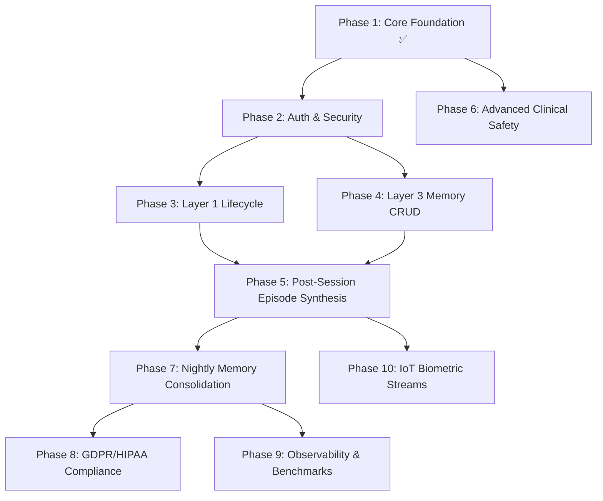

# AI Wellness Longitudinal Memory System (LMS)
## Complete Technical Build Roadmap — Phases 2 through 10

---

## 🧭 Executive Architecture & System Evolution

The **AI Wellness Longitudinal Memory System (LMS)** is built on a 4-tier memory hierarchy designed to maintain continuous personal health context across years of user interaction while optimizing token expenditure and clinical safety:

```
┌─────────────────────────────────────────────────────────────────────────────────┐
│                           AI WELLNESS LMS ARCHITECTURE                          │
└─────────────────────────────────────────────────────────────────────────────────┘
                                       │
     ┌─────────────────────────────────┼─────────────────────────────────┐
     │                                 │                                 │
     ▼                                 ▼                                 ▼
┌──────────────────────┐   ┌──────────────────────┐   ┌──────────────────────────┐
│   Layer 1: Sensory   │   │  Layer 2: Episodic   │   │    Layer 3: Semantic     │
│  Redis Buffer (30m)  │   │ PostgreSQL JSONB (14d│   │ pgvector HNSW (Multi-Yr) │
│  Active Session Flow │   │  Daily Health State  │   │  Core Facts & Triggers   │
└──────────────────────┘   └──────────────────────┘   └──────────────────────────┘
                                       ▲
                                       │
                           ┌──────────────────────┐
                           │   Layer 4: Streams   │
                           │ Timescale/Biometrics │
                           │  Wearable IoT (HRV)  │
                           └──────────────────────┘
```

### Phase Summary at a Glance

| Phase | Title | Core Deliverable | Key Tech Stack |
| :--- | :--- | :--- | :--- |
| **Phase 1** | **Core Foundation & Hybrid RAG** *(Done)* | 3-tier retrieval, safety screener, time-decay math | FastAPI, Redis, Supabase pgvector |
| **Phase 2** | **User Authentication & Security** | JWT auth, password hashing, user baseline CRUD | python-jose, passlib, bcrypt |
| **Phase 3** | **Layer 1 Lifecycle & Session Flow** | Inactivity timeout, flush handlers, session state | Redis streams/keyspace, asyncio |
| **Phase 4** | **Layer 3 Semantic Memory CRUD** | Fact editing, category search, memory pin/unpin | FastAPI, pgvector, SQLAlchemy |
| **Phase 5** | **Post-Session Episode Pipeline** | Session end triggers, structured metric extraction | OpenAI Structured Outputs, Async worker |
| **Phase 6** | **Advanced Clinical Safety (Phase 2)** | Semantic crisis screener, severity triage matrix | Cosine similarity embeddings, Fallback |
| **Phase 7** | **Nightly Memory Consolidation** | 7-day rollup, vector deduplication (>0.88), archive | Celery Beat, Redis Broker, LLM Worker |
| **Phase 8** | **GDPR/HIPAA Compliance Suite** | Full data export (ZIP/JSON), cascade deletion | StreamingResponse, Cryptography |
| **Phase 9** | **Token Observability & Benchmarks** | Prometheus exporter, Grafana dashboard, Token ROI | Prometheus client, Grafana, Pytest |
| **Phase 10**| **Wearable Biometric Ingestion** | Oura/Fitbit/Apple HealthKit sync, correlation RAG | FastAPI webhooks, Timeseries rollups |

---

## 🔐 Phase 2: User Authentication & Security

### 1. Objectives & Scope
- Provide multi-tenant isolation with secure user registration, login, token refresh, and profile management.
- Protect all Layer 1, Layer 2, and Layer 3 memory operations with user-scoped JWT authentication dependencies.

### 2. Architecture & Data Flow
```
Client Request ──► [POST /api/v1/auth/login] ──► Verify Bcrypt Hash
                        │
                        ▼
       Generate Access Token (15m) + Refresh Token (7d)
                        │
                        ▼
Authenticated Request ──► [Bearer Token] ──► `get_current_user` Dependency ──► Route Handlers
```

### 3. Detailed Component Plan
- **`app/core/security.py`**:
  - `hash_password(password: str) -> str`: Uses `passlib[bcrypt]` to hash passwords with salt.
  - `verify_password(plain: str, hashed: str) -> bool`: Safe timing-attack resistant password verification.
  - `create_access_token(data: dict, expires_delta: timedelta) -> str`: Signs JWT with `JWT_SECRET` and `HS256`.
  - `create_refresh_token(data: dict) -> str`: Long-lived token stored in DB or validated on refresh.
- **`app/api/deps.py`**:
  - `get_current_user(token: str = Depends(oauth2_scheme), db: AsyncSession)`: Extracts `user_id`, validates token expiration, and loads user record.
- **`app/api/v1/auth.py`**:
  - `POST /api/v1/auth/register`: Accepts email + password, checks uniqueness, initializes default `baseline_profile` JSONB.
  - `POST /api/v1/auth/login`: Validates credentials and returns `{access_token, refresh_token, token_type: "bearer"}`.
  - `POST /api/v1/auth/refresh`: Accepts refresh token, issues new 15-minute access token.
- **`app/api/v1/user.py` Updates**:
  - `GET /api/v1/user/me`: Returns profile and `baseline_profile` for the logged-in user.
  - `PUT /api/v1/user/me/baseline`: Updates fields such as `dataRetentionDays`, `allowBiometrics`, `knownTriggers`.

---

## ⚡ Phase 3: Layer 1 Sensory Memory & Session Lifecycle

### 1. Objectives & Scope
- Handle real-world session edge cases: session expiration, inactivity triggers, explicit "Goodbye" closures, and user mood drift detection within a session.

### 2. Architecture & Data Flow
```
User sends message ──► Check Redis Session TTL
   │
   ├─► Active (< 30 min): Append message to Redis Buffer (Max 10)
   │
   └─► Expired / Idle (> 30 min): 
          1. Emit SessionExpiredEvent
          2. Trigger Post-Session Episode Synthesis (Phase 5)
          3. Allocate new session ID and reset buffer
```

### 3. Detailed Component Plan
- **`app/services/sensory_service.py` Enhancements**:
  - Session metadata tracking (`session_start_time`, `message_count`, `last_active_timestamp`).
  - `close_session(user_id: str) -> List[ChatMessage]`: Atomically reads all session turns, flushes the key, and triggers the archival callback.
  - `detect_session_boundary(user_id: str)`: Automatic detection if user hasn't messaged in > 30 minutes.
- **`app/services/mood_tracker.py`**:
  - In-session sentiment & valence tracking across the 10-message rolling window.
  - Generates real-time alerts if mood plummets significantly within a single session.
- **`app/api/v1/session.py`**:
  - `POST /api/v1/session/end`: Explicit endpoint for clients/apps when the user closes the chat interface or logs out.
  - `GET /api/v1/session/active`: Returns current session state, remaining TTL, and turn count.

---

## 🧠 Phase 4: Layer 3 Semantic Memory CRUD & Management APIs

### 1. Objectives & Scope
- Provide transparent memory inspection and management for users (e.g. view what the AI has remembered, edit inaccurate insights, pin crucial memories, delete specific items).

### 2. Architecture & Data Flow
```
Client ──► [GET /api/v1/memories?category=trigger] ──► Filter `semantic_memories`
Client ──► [POST /api/v1/memories/manual] ──► Vectorize ──► Insert into pgvector
Client ──► [PATCH /api/v1/memories/{id}] ──► Update Text + Re-embed Vector
Client ──► [DELETE /api/v1/memories/{id}] ──► Hard Delete Single Memory
```

### 3. Detailed Component Plan
- **`app/schemas/memory.py`**:
  - `MemoryCreateRequest`, `MemoryResponse`, `MemoryUpdateRequest`, `MemoryFilterParams`.
- **`app/services/memory_service.py`**:
  - Semantic search with category filters (`trigger`, `coping_mechanism`, `baseline`, `symptom`, `milestone`).
  - Pinning critical memories (bypassing time-decay filter $S_{adjusted}$).
  - Manual memory insertion with real-time OpenAI embedding generation.
- **`app/api/v1/memories.py`**:
  - `GET /api/v1/memories`: Paginated list of memories with sorting by reinforcement count and creation date.
  - `POST /api/v1/memories`: Manually add a known health fact (e.g., "User is allergic to Penicillin").
  - `PUT /api/v1/memories/{id}`: Update memory text and automatically re-vectorize via `text-embedding-3-small`.
  - `DELETE /api/v1/memories/{id}`: Individual memory deletion.

---

## 📝 Phase 5: Post-Session Episode Synthesis & Automated Ingestion

### 1. Objectives & Scope
- Convert raw conversation turns from Layer 1 (Redis) into structured Layer 2 episodic records in PostgreSQL upon session completion.

### 2. Architecture & Data Flow
```
Session Ended (Timeout or Explicit) 
       │
       ▼
Extract Redis Messages (User + Assistant turns)
       │
       ▼
LLM Analysis (gpt-4o-mini with Structured Outputs / JSON Schema)
       │
       ▼
{
   "session_summary": "User discussed work anxiety and insomnia...",
   "extracted_metrics": {
       "moodScore": 4,
       "sleepHoursLogged": 5.5,
       "primaryStressor": "Upcoming project deadline",
       "anxietyLevel": "high",
       "physicalSymptoms": ["tension headache"]
   }
}
       │
       ▼
Insert into `episodes` Table (Linked to `user_id`)
```

### 3. Detailed Component Plan
- **`app/services/episode_synthesizer.py`**:
  - Formats the entire transcript into an evaluation prompt.
  - Uses OpenAI JSON Schema Mode to guarantee strict adherence to `EpisodeMetricsSchema`.
  - Asynchronously writes the summary and JSONB metrics to the `episodes` table.
- **`app/core/events.py`**:
  - Background task dispatcher using `FastAPI.BackgroundTasks` or Redis task queue for non-blocking synthesis.
- **Unit & Integration Tests**:
  - Validate that malformed LLM outputs fall back safely without data loss.

---

## 🛡️ Phase 6: Advanced Clinical Safety (Phase 2) — Semantic Crisis Screener

### 1. Objectives & Scope
- Upgrade the Phase 1 regex safety screener with a two-tiered semantic safety architecture capable of detecting nuanced self-harm, crisis, and psychosis indicators that bypass keyword filters.

### 2. Architecture & Data Flow
```
User Message
     │
     ├─► [Tier 1: Regex Screener] (0ms latency, catches direct keywords)
     │        │ (Crisis match)
     │        ▼
     │   Emergency Protocol Override (Crisis hotline, bypass LLM)
     │
     └─► [Tier 2: Semantic Screener] (Cosine distance against safety reference vectors)
              │ (Similarity > Threshold)
              ▼
         Emergency Protocol Override
              │ (Safe)
              ▼
         Proceed to Hybrid RAG Pipeline
```

### 3. Detailed Component Plan
- **`app/core/safety_embeddings.py`**:
  - Pre-computed embeddings of clinically validated crisis statements (C-SSRS scale benchmarks).
  - Fast vector similarity comparison using cosine distance.
- **`app/core/safety_triage.py` Enhancements**:
  - Severity classification: `LEVEL_1_INFO`, `LEVEL_2_DISTRESS`, `LEVEL_3_ACUTE_CRISIS`.
  - Level 3 triggers immediate hard override with 988 Suicide & Crisis Lifeline contact info.
  - Clinician / Crisis audit logging (anonymized safety event table).

---

## 🔄 Phase 7: Nightly Memory Consolidation, Deduplication & Archival

### 1. Objectives & Scope
- Implement the asynchronous consolidation engine that processes the past 7 days of episodic memories, extracts longitudinal facts into Layer 3 semantic memories, deduplicates vectors, and archives old episodes (>90 days).

### 2. Architecture & Data Flow
```
Nightly Cron (Celery Beat @ 02:00 UTC)
     │
     ▼
Fetch all active episodes from past 7 days per user
     │
     ▼
LLM Extraction: Extract recurring patterns, resolved issues, new baselines
     │
     ▼
For each extracted fact:
     ├── Vectorize (text-embedding-3-small)
     ├── Query pgvector for existing memories with Cosine Sim > 0.88
     │      ├─► Found: Increment `reinforcement_count` by 1
     │      └─► Not Found: Insert new row into `semantic_memories`
     ▼
Update `users.baseline_profile` JSONB if baseline changes
     │
     ▼
Cold Storage Archival: Set `archived_at = NOW()` on episodes > 90 days old
     │
     ▼
Write audit summary to `consolidation_logs` table
```

### 3. Detailed Component Plan
- **`app/workers/celery_app.py`**:
  - Configures Celery with Redis broker and Celery Beat scheduler.
- **`app/workers/tasks/consolidation.py`**:
  - `consolidate_user_memories(user_id: str)`: Orchestrates rollup, LLM extraction, deduplication, and baseline update.
  - `run_nightly_consolidation_all_users()`: Distributed batch worker iterating across active users.
- **`app/services/deduplication_engine.py`**:
  - Mathematical vector deduplication utilizing `DEDUP_THRESHOLD = 0.88`.
- **`app/services/archival_service.py`**:
  - Soft-archives episodes older than `EPISODIC_ARCHIVE_DAYS` (90 days) to keep active query indexes fast.

---

## 🔒 Phase 8: GDPR/HIPAA Compliance Suite & Right-to-Forget Phase 2

### 1. Objectives & Scope
- Deliver complete data sovereignty, verifiable cascading erasure across all databases and caches, cryptographic data export, and full audit logging.

### 2. Architecture & Data Flow
```
User Request: [POST /api/v1/compliance/export]
     │
     ▼
Gather (User Profile + Episodes JSONB + Semantic Memories + Biometrics Stream)
     │
     ▼
Package into encrypted, structured ZIP bundle (JSON + CSV format) ──► Download Stream

User Request: [DELETE /api/v1/compliance/delete-all]
     │
     ▼
1. Flush Redis sessions & cache keys (`lms:session:{user_id}:*`)
2. Delete Supabase `users` row (Triggers ON DELETE CASCADE for episodes, memories, biometrics)
3. Return cryptographic verification receipt with timestamp
```

### 3. Detailed Component Plan
- **`app/services/compliance_service.py`**:
  - `export_user_archive(user_id: str) -> BytesIO`: Compiles complete data history into JSON and CSV files within a zipped archive.
  - `verify_purge(user_id: str) -> PurgeAuditReceipt`: Verifies zero remaining rows across all tables.
- **`app/api/v1/compliance.py`**:
  - `GET /api/v1/compliance/export`: Generates downloadable patient data bundle.
  - `DELETE /api/v1/compliance/purge`: Cascading deletion endpoint with double-confirmation header.
  - `GET /api/v1/compliance/audit-trail`: Returns audit log of data access and consent agreements.

---

## 📊 Phase 9: Token Efficiency Benchmarking & Observability

### 1. Objectives & Scope
- Quantify token savings of LMS vs. naive full-history RAG, expose Prometheus metrics, and provide real-time latency and retrieval telemetry.

### 2. Architecture & Data Flow
```
Every API Request
     │
     ▼
Middleware / Interceptor:
     ├── Increment Prometheus Counters (Total requests, Cache hits, Safety triggers)
     ├── Record Retrieval Latency Histograms (Redis ms, pgvector ms, OpenAI ms)
     └── Calculate Token Savings vs. Full-History Baseline
     │
     ▼
[GET /metrics] ──► Scraped by Prometheus Server ──► Visualized in Grafana Dashboard
```

### 3. Detailed Component Plan
- **`app/core/metrics.py`**:
  - Prometheus metrics definitions:
    - `chat_requests_total{status="200"}`
    - `retrieval_latency_seconds{layer="redis|episodes|pgvector"}`
    - `tokens_consumed_total{model="gpt-4o-mini"}`
    - `tokens_saved_ratio` (LMS token footprint vs uncompressed raw chat history)
    - `safety_interventions_total{level="1|2|3"}`
- **`app/api/v1/metrics.py`**:
  - Exposes standard `/metrics` endpoint for Prometheus scraping.
- **`tests/benchmark_token_efficiency.py`**:
  - Automated benchmark script executing 30-day, 60-day, and 365-day conversational simulations.
  - Computes and asserts >70% token reduction compared to windowed full-text RAG.

---

## ⌚ Phase 10: IoT Wearable & Biometric Stream Integration (Layer 4)

### 1. Objectives & Scope
- Integrate real-time physiological data streams (Resting Heart Rate, Heart Rate Variability [HRV], Sleep Stages, SpO2) into the memory hierarchy to enable true biometrically grounded AI wellness interactions.

### 2. Architecture & Data Flow
```
Wearable Devices (Oura Ring / Apple Health / Fitbit)
       │
       ▼
[POST /api/v1/biometrics/webhook] or Scheduled Sync
       │
       ▼
Ingest into `biometrics_stream` Table (High-volume timeseries)
       │
       ▼
Automated Aggregation Engine (Daily Rollup)
       │
       ▼
Enrich Layer 2 `episodes.extracted_metrics.biometrics`
       │
       ▼
Hybrid RAG Context:
"User's HRV dropped 25% last night (32ms vs 45ms baseline) with only 42m deep sleep."
```

### 3. Detailed Component Plan
- **`app/services/wearables/oura_service.py` & `fitbit_service.py`**:
  - OAuth2 integration with third-party health APIs.
  - Webhook handlers for real-time sleep, readiness, and activity event delivery.
- **`app/services/biometric_aggregator.py`**:
  - Continuous rollups (Daily resting HR average, sleep stage distribution, HRV trends).
  - Outlier and anomaly detection (e.g. elevated heart rate indicating physical distress or fever).
- **`app/api/v1/biometrics.py`**:
  - `POST /api/v1/biometrics/ingest`: Bulk ingestion endpoint for mobile apps and wearables.
  - `GET /api/v1/biometrics/trends`: Returns time-series chart data for user-facing dashboards.
- **Hybrid RAG Integration**:
  - `retrieval_engine.py` automatically injects recent biometric anomalies into the system prompt when relevant to the user's conversational cues.

---

## 🗺️ Recommended Implementation Sequencing



---

## 🛠️ Step-by-Step Transition: What to Build Next

1. **Next Immediate Step: Phase 2 (Authentication & Multi-Tenancy)**
   - Implement password hashing, JWT issue/verify pipeline, and OAuth2 bearer dependency.
   - Guard `/api/v1/chat` and `/api/v1/user` endpoints so all retrieval queries are bound to authenticated `user_id`.
2. **Subsequent Step: Phase 4 & Phase 5 (Memory CRUD & Post-Session Synthesis)**
   - Expose explicit memory inspection endpoints.
   - Build the automated background summarizer that creates Layer 2 episodes when chat sessions end.
3. **Enterprise Hardening: Phase 6 & Phase 7 (Clinical Safety & Nightly Celery Consolidation)**
   - Deploy background workers and multi-stage vector deduplication.
