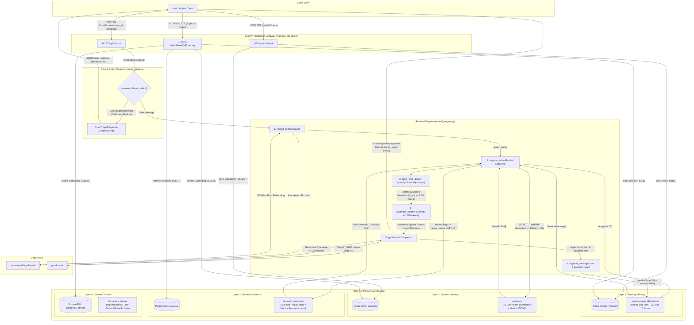

# AI Wellness Longitudinal Memory System (LMS) — End-to-End Codebase Audit & System Architecture

> **Document Classification**: Comprehensive Technical Audit & System Architecture Specification  
> **Target Audience**: Core Engineering Team, Technical Due Diligence, KAUST VSRP Research Reviewers  
> **System Core**: Python (FastAPI), Supabase (PostgreSQL + `pgvector`), Redis, OpenAI (`text-embedding-3-small` / `gpt-4o-mini`), NumPy

---

## Table of Contents

1. [File-by-File Codebase Audit](#1-file-by-file-codebase-audit)
   - [Root Directory](#root-directory)
   - [Core Infrastructure (`app/core/`)](#core-infrastructure-appcore)
   - [Data Models (`app/models/`)](#data-models-appmodels)
   - [Data Contracts & Schemas (`app/schemas/`)](#data-contracts--schemas-appschemas)
   - [Services & Retrieval Engine (`app/services/`)](#services--retrieval-engine-appservices)
   - [API Routing Layer (`app/api/v1/`)](#api-routing-layer-appapiv1)
   - [Test Suite (`tests/`)](#test-suite-tests)
2. [Section A: System Architecture Map](#section-a-system-architecture-map)
3. [Section B: Design Rationale & Architectural Trade-Offs](#section-b-design-rationale--architectural-trade-offs)
4. [Section C: Current Capabilities vs. Gaps](#section-c-current-capabilities-vs-gaps)
5. [Section D: Future Integration Points & Research Extensions](#section-d-future-integration-points--research-extensions)
6. [Section E: One-Paragraph Elevator Summary](#section-e-one-paragraph-elevator-summary)

---

## 1. File-by-File Codebase Audit

### Root Directory

---

#### [`main.py`](file:///c:/Users/Dell/OneDrive/Desktop/AI%20MEMORY%20SYSTEM/main.py)
- **Purpose**: Acts as the ASGI application entry point for FastAPI, managing the server lifecycle (startup and shutdown), global CORS middleware, top-level routing, and infrastructure health monitoring.
- **Key Components**:
  - [`lifespan(app)`](file:///c:/Users/Dell/OneDrive/Desktop/AI%20MEMORY%20SYSTEM/main.py#L50-L80): Asynchronous context manager that initializes the Redis connection pool before requests are served and gracefully closes it during server shutdown.
  - [`app`](file:///c:/Users/Dell/OneDrive/Desktop/AI%20MEMORY%20SYSTEM/main.py#L85-L106): Root `FastAPI` instance configured with metadata, OpenAPI documentation paths (`/docs`, `/redoc`), and the lifespan handler.
  - [`health_check()`](file:///c:/Users/Dell/OneDrive/Desktop/AI%20MEMORY%20SYSTEM/main.py#L125-L150): Endpoint mounted at `GET /api/v1/health` evaluating connectivity to both Supabase PostgreSQL and Redis concurrently.
  - [`root()`](file:///c:/Users/Dell/OneDrive/Desktop/AI%20MEMORY%20SYSTEM/main.py#L161-L168): Informational root endpoint returning app name, version, and documentation links.
- **Line-Level Walkthrough**:
  - [Lines 49–80](file:///c:/Users/Dell/OneDrive/Desktop/AI%20MEMORY%20SYSTEM/main.py#L49-L80): Uses standard FastAPI `lifespan` rather than deprecated `@app.on_event("startup")`. It awaits [`init_redis()`](file:///c:/Users/Dell/OneDrive/Desktop/AI%20MEMORY%20SYSTEM/app/core/redis_client.py#L51-L78) to ensure Layer 1 memory is reachable before accepting traffic, then pauses execution at `yield`. When receiving `SIGTERM`/`SIGINT`, it resumes after `yield` and awaits [`close_redis()`](file:///c:/Users/Dell/OneDrive/Desktop/AI%20MEMORY%20SYSTEM/app/core/redis_client.py#L80-L90).
  - [Lines 113–119](file:///c:/Users/Dell/OneDrive/Desktop/AI%20MEMORY%20SYSTEM/main.py#L113-L119): Configures `CORSMiddleware`. In debug mode (`DEBUG=True`), origins are open (`"*"`); in non-debug mode, it hardcodes `["https://your-app-domain.com"]`.
  - [Lines 140–149](file:///c:/Users/Dell/OneDrive/Desktop/AI%20MEMORY%20SYSTEM/main.py#L140-L149): Runs `ping_database()` and `ping_redis()`. If either fails, status is marked `"degraded"` with HTTP 200 rather than returning a 503 HTTP status code.
- **Dependencies**:
  - *Imports*: [`get_settings`](file:///c:/Users/Dell/OneDrive/Desktop/AI%20MEMORY%20SYSTEM/app/core/config.py#L113-L126), [`ping_database`](file:///c:/Users/Dell/OneDrive/Desktop/AI%20MEMORY%20SYSTEM/app/core/database.py#L138-L153), [`init_redis`, `close_redis`, `ping_redis`](file:///c:/Users/Dell/OneDrive/Desktop/AI%20MEMORY%20SYSTEM/app/core/redis_client.py#L51-L135), [`api_router`](file:///c:/Users/Dell/OneDrive/Desktop/AI%20MEMORY%20SYSTEM/app/api/v1/router.py#L9-L12), [`HealthResponse`](file:///c:/Users/Dell/OneDrive/Desktop/AI%20MEMORY%20SYSTEM/app/schemas/chat.py#L117-L124).
  - *Called By*: ASGI web servers (`uvicorn main:app --reload`), pytest test client in [`tests/test_chat_pipeline.py`](file:///c:/Users/Dell/OneDrive/Desktop/AI%20MEMORY%20SYSTEM/tests/test_chat_pipeline.py#L19).
- **Data Flow**: Intercepts HTTP ingress, registers routes, delegates health probe signals to PostgreSQL and Redis, and outputs system status responses.
- **Audit Findings**:
  - *Fragility*: In production, hardcoding `https://your-app-domain.com` in code rather than reading allowed origins from `settings.ALLOWED_ORIGINS` makes multi-environment deployment rigid.
  - *Inconsistency*: Health check returns status code `200` with `"degraded"` status when a backend dependency is down, which may prevent some cloud load balancers from detecting failed instances unless configured for body inspection.

---

#### [`schema.sql`](file:///c:/Users/Dell/OneDrive/Desktop/AI%20MEMORY%20SYSTEM/schema.sql)
- **Purpose**: Defines the complete PostgreSQL relational schema, `pgvector` extension configuration, vector indexing parameters, and JSONB schemas for all memory layers and audit logs in Supabase.
- **Key Components**:
  - `CREATE EXTENSION IF NOT EXISTS vector`: Enables vector data types and indexing operators.
  - `users`: Core identity table with JSONB `baseline_profile` storing evolving user health baselines.
  - `episodes`: Layer 2 episodic storage containing session summaries, structured health metrics JSONB (`moodScore`, `physicalSymptoms`, `primaryStressor`), and cold-storage tracking (`archived_at`).
  - `semantic_memories`: Layer 3 long-term knowledge store holding 1536-dimensional vectors, text facts, categorical constraints, and reinforcement counts.
  - `biometrics_stream`: Layer 4 time-series store for wearable signals (HRV, Resting HR, Sleep stages).
  - `consolidation_logs`: Audit log table recording nightly consolidation jobs.
- **Line-Level Walkthrough**:
  - [Line 22](file:///c:/Users/Dell/OneDrive/Desktop/AI%20MEMORY%20SYSTEM/schema.sql#L22): Installs the `vector` extension in the PostgreSQL public schema.
  - [Lines 44–50](file:///c:/Users/Dell/OneDrive/Desktop/AI%20MEMORY%20SYSTEM/schema.sql#L44-L50): Seeds `baseline_profile` with default keys (`averageSleepHours`, `knownTriggers`, `effectiveCopingMechanisms`, `dataRetentionDays`, `allowBiometrics`).
  - [Lines 74–91](file:///c:/Users/Dell/OneDrive/Desktop/AI%20MEMORY%20SYSTEM/schema.sql#L74-L91): Foreign key on `user_id` enforces `ON DELETE CASCADE` for GDPR compliance.
  - [Lines 94–100](file:///c:/Users/Dell/OneDrive/Desktop/AI%20MEMORY%20SYSTEM/schema.sql#L94-L100): Creates both a composite index `(user_id, timestamp DESC)` and a partial index `WHERE archived_at IS NULL` to speed up active 14-day window scans.
  - [Lines 127–143](file:///c:/Users/Dell/OneDrive/Desktop/AI%20MEMORY%20SYSTEM/schema.sql#L127-L143): Constrains `category` to `('trigger', 'baseline', 'coping_mechanism', 'symptom', 'milestone')`. Column `embedding` is sized at `vector(1536)` matching OpenAI `text-embedding-3-small`.
  - [Lines 148–151](file:///c:/Users/Dell/OneDrive/Desktop/AI%20MEMORY%20SYSTEM/schema.sql#L148-L151): Defines an HNSW index using `vector_cosine_ops` with hyperparameters `m = 16` (max bi-directional links per node) and `ef_construction = 64` (search depth during index build).
- **Dependencies**:
  - *Imports*: None (pure DDL).
  - *Called By*: Run manually or via migration tools in Supabase SQL editor; mirrored in Python ORM classes [`app/models/`](file:///c:/Users/Dell/OneDrive/Desktop/AI%20MEMORY%20SYSTEM/app/models/).
- **Data Flow**: Dictates the persistent on-disk schema and foreign key cascading constraints across all PostgreSQL storage operations.

---

#### [`requirements.txt`](file:///c:/Users/Dell/OneDrive/Desktop/AI%20MEMORY%20SYSTEM/requirements.txt)
- **Purpose**: Declares exact pinned and minimum dependencies for the web server, async database connectivity, vector math, background processing, security, and test runners.
- **Key Components**:
  - `fastapi==0.115.0`, `uvicorn[standard]==0.30.6`: Async web runtime.
  - `pydantic==2.8.2`, `pydantic-settings==2.4.0`: Typed schema and environment configuration.
  - `sqlalchemy==2.0.35`, `asyncpg>=0.29.0`, `pgvector==0.3.2`: Async PostgreSQL ORM and vector extension bindings.
  - `redis==5.1.1`, `redis[hiredis]==5.1.1`: Async Redis driver for Layer 1 memory and Celery task broker.
  - `openai==1.50.2`: SDK for embeddings (`text-embedding-3-small`) and chat (`gpt-4o-mini`).
  - `numpy==2.1.1`: Vectorized mathematical calculations for exponential time decay.
  - `python-jose`, `passlib[bcrypt]`, `celery`, `structlog`, `pytest`, `pytest-asyncio`: Supporting infrastructure.
- **Line-Level Walkthrough**:
  - Pins core libraries to stable major/minor versions to prevent breaking API changes in Pydantic v2 and SQLAlchemy 2.0. Includes notes regarding Windows build environments for C-extensions (`asyncpg`).
- **Dependencies**:
  - *Referenced By*: Setup workflows (`pip install -r requirements.txt`).

---

#### [`.env.example`](file:///c:/Users/Dell/OneDrive/Desktop/AI%20MEMORY%20SYSTEM/.env.example)
- **Purpose**: Serves as the environment configuration template documenting all required and optional runtime configuration keys, database connection strings, model names, and mathematical hyperparameters.
- **Key Components**:
  - Database & Cache keys: `SUPABASE_DB_URL`, `REDIS_URL`, `REDIS_SESSION_TTL`, `REDIS_MAX_MESSAGES`.
  - OpenAI credentials & models: `OPENAI_API_KEY`, `OPENAI_EMBEDDING_MODEL`, `OPENAI_CHAT_MODEL`, `OPENAI_CHAT_TEMPERATURE`.
  - Decay math & retrieval parameters: `DECAY_LAMBDA`, `SIMILARITY_THRESHOLD`, `DEDUP_THRESHOLD`, `EPISODIC_ACTIVE_DAYS`, `EPISODIC_ARCHIVE_DAYS`.
- **Line-Level Walkthrough**:
  - Documents the required driver prefix `postgresql+asyncpg://` needed by SQLAlchemy 2.0 async engine and specifies sliding window time-to-live values (1800 seconds).
- **Dependencies**:
  - *Loaded By*: [`app/core/config.py`](file:///c:/Users/Dell/OneDrive/Desktop/AI%20MEMORY%20SYSTEM/app/core/config.py#L105) via Pydantic `SettingsConfigDict`.

---

#### [`README.md`](file:///c:/Users/Dell/OneDrive/Desktop/AI%20MEMORY%20SYSTEM/README.md)
- **Purpose**: High-level repository documentation containing setup guides, architecture schematics, test commands, API summaries, and phase milestones.
- **Key Components**:
  - Step-by-step developer onboarding instructions.
  - ASCII representation of the RAG pipeline flow.
  - Time-decay mathematical explanation.
- **Dependencies**:
  - References all primary endpoints and configuration files.

---

#### [`BUILD_PHASES_ROADMAP.md`](file:///c:/Users/Dell/OneDrive/Desktop/AI%20MEMORY%20SYSTEM/BUILD_PHASES_ROADMAP.md)
- **Purpose**: Comprehensive 10-phase engineering specification and architectural design document detailing the transition from Phase 1 (foundation) through Phase 10 (IoT wearables).
- **Key Components**:
  - Detailed design specs for Phase 2 (JWT auth), Phase 3 (Session lifecycle), Phase 4 (Memory CRUD), Phase 5 (Episode synthesis), Phase 6 (Semantic safety screener), Phase 7 (Nightly consolidation & deduplication), Phase 8 (GDPR compliance), Phase 9 (Observability & benchmarking), and Phase 10 (Wearable time-series ingestion).
  - Dependency sequencing Mermaid graph.
- **Dependencies**:
  - References future modules and schema evolutions.

---

### Core Infrastructure (`app/core/`)

---

#### [`app/__init__.py`](file:///c:/Users/Dell/OneDrive/Desktop/AI%20MEMORY%20SYSTEM/app/__init__.py), [`app/core/__init__.py`](file:///c:/Users/Dell/OneDrive/Desktop/AI%20MEMORY%20SYSTEM/app/core/__init__.py), [`app/models/__init__.py`](file:///c:/Users/Dell/OneDrive/Desktop/AI%20MEMORY%20SYSTEM/app/models/__init__.py), [`app/schemas/__init__.py`](file:///c:/Users/Dell/OneDrive/Desktop/AI%20MEMORY%20SYSTEM/app/schemas/__init__.py), [`app/services/__init__.py`](file:///c:/Users/Dell/OneDrive/Desktop/AI%20MEMORY%20SYSTEM/app/services/__init__.py), [`app/api/__init__.py`](file:///c:/Users/Dell/OneDrive/Desktop/AI%20MEMORY%20SYSTEM/app/api/__init__.py), [`app/api/v1/__init__.py`](file:///c:/Users/Dell/OneDrive/Desktop/AI%20MEMORY%20SYSTEM/app/api/v1/__init__.py), [`tests/__init__.py`](file:///c:/Users/Dell/OneDrive/Desktop/AI%20MEMORY%20SYSTEM/tests/__init__.py)
- **Purpose**: Standard Python package marker files defining module boundaries across the codebase.
- **Key Components**: Empty or single-line package initialization statements.
- **Line-Level Walkthrough**: Standard boilerplate package markers.

---

#### [`app/core/config.py`](file:///c:/Users/Dell/OneDrive/Desktop/AI%20MEMORY%20SYSTEM/app/core/config.py)
- **Purpose**: Centralized, type-enforced configuration system using Pydantic `BaseSettings` that parses `.env` variables and validates them upon application boot.
- **Key Components**:
  - [`Settings`](file:///c:/Users/Dell/OneDrive/Desktop/AI%20MEMORY%20SYSTEM/app/core/config.py#L27-L110): Pydantic model declaring typed configuration fields for application runtime, database connection pooling, Redis buffers, OpenAI models, retrieval hyperparameters, and auth secrets.
  - [`get_settings()`](file:///c:/Users/Dell/OneDrive/Desktop/AI%20MEMORY%20SYSTEM/app/core/config.py#L113-L126): LRU-cached factory function ensuring settings are parsed once from disk and reused as an in-memory singleton.
- **Line-Level Walkthrough**:
  - [Lines 27–110](file:///c:/Users/Dell/OneDrive/Desktop/AI%20MEMORY%20SYSTEM/app/core/config.py#L27-L110): Declares fields such as `SUPABASE_DB_URL: str` and `OPENAI_API_KEY: str` without default values, enforcing fail-fast behavior if mandatory keys are missing. Fields like `DECAY_LAMBDA: float = 0.005` provide verified mathematical defaults.
  - [Lines 104–109](file:///c:/Users/Dell/OneDrive/Desktop/AI%20MEMORY%20SYSTEM/app/core/config.py#L104-L109): `model_config = SettingsConfigDict(env_file=".env", case_sensitive=True, extra="ignore")` instructs Pydantic to enforce exact case matching while ignoring unknown keys.
  - [Lines 112–126](file:///c:/Users/Dell/OneDrive/Desktop/AI%20MEMORY%20SYSTEM/app/core/config.py#L112-L126): Decorates `get_settings` with `@lru_cache(maxsize=1)` to avoid disk I/O overhead on repeated settings access across service files.
- **Dependencies**:
  - *Imports*: `pydantic_settings.BaseSettings`, `pydantic_settings.SettingsConfigDict`, `functools.lru_cache`.
  - *Called By*: [`app/core/database.py`](file:///c:/Users/Dell/OneDrive/Desktop/AI%20MEMORY%20SYSTEM/app/core/database.py#L43), [`app/core/redis_client.py`](file:///c:/Users/Dell/OneDrive/Desktop/AI%20MEMORY%20SYSTEM/app/core/redis_client.py#L37), [`app/services/embedding_service.py`](file:///c:/Users/Dell/OneDrive/Desktop/AI%20MEMORY%20SYSTEM/app/services/embedding_service.py#L32), [`app/services/sensory_service.py`](file:///c:/Users/Dell/OneDrive/Desktop/AI%20MEMORY%20SYSTEM/app/services/sensory_service.py#L44), [`app/services/retrieval_engine.py`](file:///c:/Users/Dell/OneDrive/Desktop/AI%20MEMORY%20SYSTEM/app/services/retrieval_engine.py#L67), [`app/api/v1/chat.py`](file:///c:/Users/Dell/OneDrive/Desktop/AI%20MEMORY%20SYSTEM/app/api/v1/chat.py#L34), [`main.py`](file:///c:/Users/Dell/OneDrive/Desktop/AI%20MEMORY%20SYSTEM/main.py#L43).
- **Data Flow**: Reads `.env` from disk on first call and feeds typed configuration attributes to every subsystem.

---

#### [`app/core/database.py`](file:///c:/Users/Dell/OneDrive/Desktop/AI%20MEMORY%20SYSTEM/app/core/database.py)
- **Purpose**: Establishes and manages the asynchronous SQLAlchemy connection pool to Supabase PostgreSQL, provides the base declarative model class, and exports a per-request session dependency.
- **Key Components**:
  - [`engine`](file:///c:/Users/Dell/OneDrive/Desktop/AI%20MEMORY%20SYSTEM/app/core/database.py#L58-L65): Async SQLAlchemy engine configured with connection pooling (`pool_size=5`, `max_overflow=10`, `pool_pre_ping=True`).
  - [`AsyncSessionLocal`](file:///c:/Users/Dell/OneDrive/Desktop/AI%20MEMORY%20SYSTEM/app/core/database.py#L74-L80): Sessionmaker producing async database sessions with `expire_on_commit=False`.
  - [`Base`](file:///c:/Users/Dell/OneDrive/Desktop/AI%20MEMORY%20SYSTEM/app/core/database.py#L90-L99): Declarative base class subclassing `DeclarativeBase` for all ORM models.
  - [`get_db()`](file:///c:/Users/Dell/OneDrive/Desktop/AI%20MEMORY%20SYSTEM/app/core/database.py#L118-L133): FastAPI asynchronous generator dependency providing automatic transaction commit, rollback on error, and session cleanup.
  - [`ping_database()`](file:///c:/Users/Dell/OneDrive/Desktop/AI%20MEMORY%20SYSTEM/app/core/database.py#L138-L153): Diagnostic health probe executing `SELECT 1`.
- **Line-Level Walkthrough**:
  - [Lines 58–65](file:///c:/Users/Dell/OneDrive/Desktop/AI%20MEMORY%20SYSTEM/app/core/database.py#L58-L65): `pool_pre_ping=True` emits a lightweight heartbeat to detect and recycle stale or dropped Supabase TCP connections before executing application queries.
  - [Lines 74–80](file:///c:/Users/Dell/OneDrive/Desktop/AI%20MEMORY%20SYSTEM/app/core/database.py#L74-L80): `expire_on_commit=False` prevents SQLAlchemy from purging object state on transaction commit, avoiding asynchronous lazy-loading exceptions.
  - [Lines 118–133](file:///c:/Users/Dell/OneDrive/Desktop/AI%20MEMORY%20SYSTEM/app/core/database.py#L118-L133): Wraps route execution in a `try...except...finally` block. Upon successful handler completion, `await session.commit()` persists modifications; on any unhandled exception, `await session.rollback()` reverts dirty state.
- **Dependencies**:
  - *Imports*: `sqlalchemy.ext.asyncio.*`, `app.core.config.get_settings`.
  - *Called By*: All models in [`app/models/`](file:///c:/Users/Dell/OneDrive/Desktop/AI%20MEMORY%20SYSTEM/app/models/), API endpoints via `Depends(get_db)` in [`app/api/v1/chat.py`](file:///c:/Users/Dell/OneDrive/Desktop/AI%20MEMORY%20SYSTEM/app/api/v1/chat.py#L58) and [`app/api/v1/user.py`](file:///c:/Users/Dell/OneDrive/Desktop/AI%20MEMORY%20SYSTEM/app/api/v1/user.py#L44), and [`main.py`](file:///c:/Users/Dell/OneDrive/Desktop/AI%20MEMORY%20SYSTEM/main.py#L37).
- **Data Flow**: Coordinates async database connection leasing and ensures transactional ACID boundaries between route handlers and PostgreSQL.

---

#### [`app/core/redis_client.py`](file:///c:/Users/Dell/OneDrive/Desktop/AI%20MEMORY%20SYSTEM/app/core/redis_client.py)
- **Purpose**: Manages the application-wide asynchronous Redis connection pool, providing client retrieval, FastAPI dependency injection, and health verification for Layer 1 Sensory Memory.
- **Key Components**:
  - `_redis_pool`: Module-level singleton holding the `aioredis.Redis` connection pool.
  - [`init_redis()`](file:///c:/Users/Dell/OneDrive/Desktop/AI%20MEMORY%20SYSTEM/app/core/redis_client.py#L51-L78): Creates the Redis client pool with connection timeouts and executes a startup `ping()`.
  - [`close_redis()`](file:///c:/Users/Dell/OneDrive/Desktop/AI%20MEMORY%20SYSTEM/app/core/redis_client.py#L80-L90): Closes all pool connections during application shutdown.
  - [`get_redis_client()`](file:///c:/Users/Dell/OneDrive/Desktop/AI%20MEMORY%20SYSTEM/app/core/redis_client.py#L92-L106): Retrieves the raw Redis client instance for background tasks or standalone services.
  - [`get_redis()`](file:///c:/Users/Dell/OneDrive/Desktop/AI%20MEMORY%20SYSTEM/app/core/redis_client.py#L108-L118): FastAPI dependency yielding the shared Redis client to HTTP handlers.
  - [`ping_redis()`](file:///c:/Users/Dell/OneDrive/Desktop/AI%20MEMORY%20SYSTEM/app/core/redis_client.py#L123-L135): Health check utility verifying Redis reachability.
- **Line-Level Walkthrough**:
  - [Lines 65–74](file:///c:/Users/Dell/OneDrive/Desktop/AI%20MEMORY%20SYSTEM/app/core/redis_client.py#L65-L74): `aioredis.from_url` uses `decode_responses=True` so data is returned directly as Python `str` instead of raw `bytes`. `socket_connect_timeout=5` prevents thread hanging on connection drops.
  - [Lines 100–105](file:///c:/Users/Dell/OneDrive/Desktop/AI%20MEMORY%20SYSTEM/app/core/redis_client.py#L100-L105): Raises `RuntimeError` if client methods are called prior to `init_redis()` execution.
- **Dependencies**:
  - *Imports*: `redis.asyncio as aioredis`, `app.core.config.get_settings`.
  - *Called By*: [`main.py`](file:///c:/Users/Dell/OneDrive/Desktop/AI%20MEMORY%20SYSTEM/main.py#L38), [`app/api/v1/chat.py`](file:///c:/Users/Dell/OneDrive/Desktop/AI%20MEMORY%20SYSTEM/app/api/v1/chat.py#L59), [`app/api/v1/user.py`](file:///c:/Users/Dell/OneDrive/Desktop/AI%20MEMORY%20SYSTEM/app/api/v1/user.py#L45), [`app/services/sensory_service.py`](file:///c:/Users/Dell/OneDrive/Desktop/AI%20MEMORY%20SYSTEM/app/services/sensory_service.py).
- **Data Flow**: Connects FastAPI request pipelines directly to Redis key-value storage for sub-millisecond session state operations.

---

#### [`app/core/safety_triage.py`](file:///c:/Users/Dell/OneDrive/Desktop/AI%20MEMORY%20SYSTEM/app/core/safety_triage.py)
- **Purpose**: Implements a deterministic, zero-latency clinical safety gate (Hard Override) that screens all incoming user messages against crisis patterns before any RAG retrieval or LLM execution occurs.
- **Key Components**:
  - `CRISIS_RESOURCES`: Registry of verified emergency crisis lines and mental health helplines.
  - `SELF_HARM_KEYWORDS`, `EATING_DISORDER_CRISIS_KEYWORDS`, `ACUTE_MEDICAL_KEYWORDS`: Regex pattern sets categorizing crisis types.
  - `_ALL_PATTERNS` & `_PATTERN_TYPE_MAP`: Pre-compiled regular expressions mapped to crisis classification strings.
  - [`TriageResponse`](file:///c:/Users/Dell/OneDrive/Desktop/AI%20MEMORY%20SYSTEM/app/core/safety_triage.py#L136-L168): Dataclass encapsulating crisis classification, empathetic non-clinical messaging, helpline data, and internal audit triggers.
  - [`SafetyResult`](file:///c:/Users/Dell/OneDrive/Desktop/AI%20MEMORY%20SYSTEM/app/core/safety_triage.py#L170-L180): Container returned to callers indicating boolean pass/fail status and optional triage payload.
  - [`evaluate_clinical_safety(message, user_id)`](file:///c:/Users/Dell/OneDrive/Desktop/AI%20MEMORY%20SYSTEM/app/core/safety_triage.py#L209-L258): Main evaluation engine scanning message text against compiled regex sets.
- **Line-Level Walkthrough**:
  - [Lines 112–130](file:///c:/Users/Dell/OneDrive/Desktop/AI%20MEMORY%20SYSTEM/app/core/safety_triage.py#L112-L130): Compiles regex patterns once at module load using `re.IGNORECASE | re.MULTILINE` to optimize per-message screening latency ($<1\text{ms}$).
  - [Lines 157–167](file:///c:/Users/Dell/OneDrive/Desktop/AI%20MEMORY%20SYSTEM/app/core/safety_triage.py#L157-L167): `to_client_response()` strips the internal `triggered_by` audit attribute before returning JSON payloads to client applications.
  - [Lines 232–255](file:///c:/Users/Dell/OneDrive/Desktop/AI%20MEMORY%20SYSTEM/app/core/safety_triage.py#L232-L255): Iterates through `_PATTERN_TYPE_MAP`. On a match, logs an anonymized warning containing `user_id` and pattern metadata (without logging user message contents to preserve privacy) and halts evaluation immediately.
- **Dependencies**:
  - *Imports*: `re`, `dataclasses.*`, `structlog`.
  - *Called By*: [`app/api/v1/chat.py`](file:///c:/Users/Dell/OneDrive/Desktop/AI%20MEMORY%20SYSTEM/app/api/v1/chat.py#L82-L94), unit tested extensively in [`tests/test_safety_triage.py`](file:///c:/Users/Dell/OneDrive/Desktop/AI%20MEMORY%20SYSTEM/tests/test_safety_triage.py).
- **Data Flow**: Ingests raw user string input; if flagged, diverts control flow away from database and OpenAI pipelines, emitting structured crisis JSON immediately.

---

### Data Models (`app/models/`)

---

#### [`app/models/user.py`](file:///c:/Users/Dell/OneDrive/Desktop/AI%20MEMORY%20SYSTEM/app/models/user.py)
- **Purpose**: SQLAlchemy ORM model representing the `users` table in Supabase, managing authentication attributes and the longitudinal `baseline_profile` JSONB blob.
- **Key Components**:
  - [`User`](file:///c:/Users/Dell/OneDrive/Desktop/AI%20MEMORY%20SYSTEM/app/models/user.py#L11-L44): ORM class mapping `user_id`, `email`, `password_hash`, `created_at`, and `baseline_profile`.
- **Line-Level Walkthrough**:
  - [Lines 29–43](file:///c:/Users/Dell/OneDrive/Desktop/AI%20MEMORY%20SYSTEM/app/models/user.py#L29-L43): Defines `user_id` as primary key `String`. The `baseline_profile` column uses PostgreSQL `JSONB` with default structure tracking sleep averages, coping mechanisms, and trigger lists.
- **Dependencies**:
  - *Imports*: `sqlalchemy.*`, `sqlalchemy.dialects.postgresql.JSONB`, [`app.core.database.Base`](file:///c:/Users/Dell/OneDrive/Desktop/AI%20MEMORY%20SYSTEM/app/core/database.py#L90).
  - *Referenced By*: Auth endpoints (Phase 2), Profile inspection in [`app/api/v1/user.py`](file:///c:/Users/Dell/OneDrive/Desktop/AI%20MEMORY%20SYSTEM/app/api/v1/user.py#L117-L124).
- **Data Flow**: Persists identity credentials and receives consolidated baseline profile updates generated by background consolidation jobs.

---

#### [`app/models/episode.py`](file:///c:/Users/Dell/OneDrive/Desktop/AI%20MEMORY%20SYSTEM/app/models/episode.py)
- **Purpose**: SQLAlchemy ORM model representing Layer 2 Episodic Memory in the `episodes` table, storing structured session summaries and typed health indicators.
- **Key Components**:
  - [`Episode`](file:///c:/Users/Dell/OneDrive/Desktop/AI%20MEMORY%20SYSTEM/app/models/episode.py#L28-L69): ORM class mapping `id`, `user_id`, `timestamp`, `session_summary`, `extracted_metrics`, and `archived_at`.
- **Line-Level Walkthrough**:
  - [Lines 51–68](file:///c:/Users/Dell/OneDrive/Desktop/AI%20MEMORY%20SYSTEM/app/models/episode.py#L51-L68): Defines `id` with database default `gen_random_uuid()`. `extracted_metrics` defaults to a JSONB schema with `moodScore`, `physicalSymptoms`, `primaryStressor`, `sleepHoursLogged`, `anxietyLevel`, `energyLevel`, and nested `biometrics`.
  - [Line 68](file:///c:/Users/Dell/OneDrive/Desktop/AI%20MEMORY%20SYSTEM/app/models/episode.py#L68): `archived_at` defaults to `None`, indicating an active episode available for Layer 2 14-day sliding retrieval.
- **Dependencies**:
  - *Imports*: `sqlalchemy.*`, `sqlalchemy.dialects.postgresql.JSONB`, [`app.core.database.Base`](file:///c:/Users/Dell/OneDrive/Desktop/AI%20MEMORY%20SYSTEM/app/core/database.py#L90).
  - *Referenced By*: [`app/services/retrieval_engine.py`](file:///c:/Users/Dell/OneDrive/Desktop/AI%20MEMORY%20SYSTEM/app/services/retrieval_engine.py#L158-L221), post-session episode synthesis (Phase 5), nightly consolidation (Phase 7).
- **Data Flow**: Reads recent rows within active retrieval windows during RAG execution; receives new summary rows upon session completion.

---

#### [`app/models/semantic_memory.py`](file:///c:/Users/Dell/OneDrive/Desktop/AI%20MEMORY%20SYSTEM/app/models/semantic_memory.py)
- **Purpose**: SQLAlchemy ORM model representing Layer 3 Semantic Memory in the `semantic_memories` table, storing discrete long-term health facts along with 1536-dimensional embedding vectors.
- **Key Components**:
  - [`SemanticMemory`](file:///c:/Users/Dell/OneDrive/Desktop/AI%20MEMORY%20SYSTEM/app/models/semantic_memory.py#L40-L67): ORM class mapping `id`, `user_id`, `category`, `text`, `embedding`, `reinforcement_count`, and `created_at`.
- **Line-Level Walkthrough**:
  - [Lines 60–66](file:///c:/Users/Dell/OneDrive/Desktop/AI%20MEMORY%20SYSTEM/app/models/semantic_memory.py#L60-L66): `embedding = Column(Vector(1536))` uses `pgvector.sqlalchemy.Vector` to store embeddings. `reinforcement_count` tracks how many times a recurring health pattern has been reaffirmed.
  - [Line 66](file:///c:/Users/Dell/OneDrive/Desktop/AI%20MEMORY%20SYSTEM/app/models/semantic_memory.py#L66): `created_at` provides the temporal reference point for the exponential decay function $S_{adjusted} = S_{raw} \times e^{-\lambda \Delta t}$.
- **Dependencies**:
  - *Imports*: `sqlalchemy.*`, `pgvector.sqlalchemy.Vector`, [`app.core.database.Base`](file:///c:/Users/Dell/OneDrive/Desktop/AI%20MEMORY%20SYSTEM/app/core/database.py#L90).
  - *Referenced By*: [`app/services/retrieval_engine.py`](file:///c:/Users/Dell/OneDrive/Desktop/AI%20MEMORY%20SYSTEM/app/services/retrieval_engine.py#L227-L282), consolidation deduplication engine (Phase 7).
- **Data Flow**: Scanned by HNSW index vector queries; updated when consolidation deduplication increments reinforcement counts.

---

#### [`app/models/biometrics.py`](file:///c:/Users/Dell/OneDrive/Desktop/AI%20MEMORY%20SYSTEM/app/models/biometrics.py)
- **Purpose**: SQLAlchemy ORM model representing Layer 4 Biometric Streams in the `biometrics_stream` table for high-frequency wearable sensor telemetry.
- **Key Components**:
  - [`BiometricsStream`](file:///c:/Users/Dell/OneDrive/Desktop/AI%20MEMORY%20SYSTEM/app/models/biometrics.py#L21-L38): ORM class mapping `id`, `time`, `user_id`, `metric_type`, `value`, `device_id`, and `quality_flag`.
- **Line-Level Walkthrough**:
  - [Lines 31–37](file:///c:/Users/Dell/OneDrive/Desktop/AI%20MEMORY%20SYSTEM/app/models/biometrics.py#L31-L37): Indexed on `time` and `user_id`. `metric_type` stores sensor keys (`resting_hr`, `hrv_rmssd`, `spo2`), while `quality_flag` allows filtering noisy or artifact sensor data.
- **Dependencies**:
  - *Imports*: `sqlalchemy.*`, [`app.core.database.Base`](file:///c:/Users/Dell/OneDrive/Desktop/AI%20MEMORY%20SYSTEM/app/core/database.py#L90).
  - *Referenced By*: Deletion cascading in [`app/api/v1/user.py`](file:///c:/Users/Dell/OneDrive/Desktop/AI%20MEMORY%20SYSTEM/app/api/v1/user.py#L73), IoT ingestion pipeline (Phase 10).
- **Data Flow**: Ingests high-frequency device metrics to feed time-series rollups and enrich Layer 2 episodes.

---

### Data Contracts & Schemas (`app/schemas/`)

---

#### [`app/schemas/chat.py`](file:///c:/Users/Dell/OneDrive/Desktop/AI%20MEMORY%20SYSTEM/app/schemas/chat.py)
- **Purpose**: Defines Pydantic v2 data models for API request validation, Redis session message serialization, crisis triage responses, and health endpoint schemas.
- **Key Components**:
  - [`ChatRequest`](file:///c:/Users/Dell/OneDrive/Desktop/AI%20MEMORY%20SYSTEM/app/schemas/chat.py#L27-L49): Validates incoming user messages (lengths between 1 and 2000 characters) and `user_id`.
  - [`SessionMessage`](file:///c:/Users/Dell/OneDrive/Desktop/AI%20MEMORY%20SYSTEM/app/schemas/chat.py#L55-L67): Schema for Layer 1 Redis buffer messages (`role`, `content`, `timestamp`).
  - [`ChatResponse`](file:///c:/Users/Dell/OneDrive/Desktop/AI%20MEMORY%20SYSTEM/app/schemas/chat.py#L73-L89): Outgoing response model returning LLM text, session key, memory count, and optional debug telemetry.
  - [`CrisisResource`](file:///c:/Users/Dell/OneDrive/Desktop/AI%20MEMORY%20SYSTEM/app/schemas/chat.py#L95-L100) & [`CrisisTriageResponse`](file:///c:/Users/Dell/OneDrive/Desktop/AI%20MEMORY%20SYSTEM/app/schemas/chat.py#L102-L111): Contract for clinical crisis override payloads.
  - [`HealthResponse`](file:///c:/Users/Dell/OneDrive/Desktop/AI%20MEMORY%20SYSTEM/app/schemas/chat.py#L117-L124): Response model for system status and dependency health.
- **Line-Level Walkthrough**:
  - [Lines 35–48](file:///c:/Users/Dell/OneDrive/Desktop/AI%20MEMORY%20SYSTEM/app/schemas/chat.py#L35-L48): Uses Pydantic `Field(min_length=1, max_length=2000)` on incoming messages to reject empty strings or oversized payloads before downstream processing.
  - [Lines 60–66](file:///c:/Users/Dell/OneDrive/Desktop/AI%20MEMORY%20SYSTEM/app/schemas/chat.py#L60-L66): Constrains `role` strictly to `Literal["user", "assistant"]`.
- **Dependencies**:
  - *Imports*: `pydantic.BaseModel`, `pydantic.Field`, `typing.*`, `datetime.datetime`.
  - *Called By*: [`app/api/v1/chat.py`](file:///c:/Users/Dell/OneDrive/Desktop/AI%20MEMORY%20SYSTEM/app/api/v1/chat.py#L30), [`app/services/sensory_service.py`](file:///c:/Users/Dell/OneDrive/Desktop/AI%20MEMORY%20SYSTEM/app/services/sensory_service.py#L41), [`main.py`](file:///c:/Users/Dell/OneDrive/Desktop/AI%20MEMORY%20SYSTEM/main.py#L40).
- **Data Flow**: Acts as the boundary filter on incoming HTTP requests and serializes outgoing responses.

---

### Services & Retrieval Engine (`app/services/`)

---

#### [`app/services/embedding_service.py`](file:///c:/Users/Dell/OneDrive/Desktop/AI%20MEMORY%20SYSTEM/app/services/embedding_service.py)
- **Purpose**: Encapsulates OpenAI vector embedding generation using `text-embedding-3-small`, transforming unstructured natural language into 1536-dimensional float arrays.
- **Key Components**:
  - `_openai_client`: Module-level singleton instance of `AsyncOpenAI`.
  - [`get_openai_client()`](file:///c:/Users/Dell/OneDrive/Desktop/AI%20MEMORY%20SYSTEM/app/services/embedding_service.py#L42-L47): Initializes or retrieves the shared asynchronous OpenAI client.
  - [`embed_text(text)`](file:///c:/Users/Dell/OneDrive/Desktop/AI%20MEMORY%20SYSTEM/app/services/embedding_service.py#L50-L96): Generates a single 1536-dim vector from a string.
  - [`embed_batch(texts)`](file:///c:/Users/Dell/OneDrive/Desktop/AI%20MEMORY%20SYSTEM/app/services/embedding_service.py#L99-L140): Batch-vectorizes multiple text strings in a single network round-trip.
- **Line-Level Walkthrough**:
  - [Lines 70–75](file:///c:/Users/Dell/OneDrive/Desktop/AI%20MEMORY%20SYSTEM/app/services/embedding_service.py#L70-L75): Validates non-empty input and clips text at 10,000 characters to prevent token overflow exceptions.
  - [Lines 80–85](file:///c:/Users/Dell/OneDrive/Desktop/AI%20MEMORY%20SYSTEM/app/services/embedding_service.py#L80-L85): Calls `client.embeddings.create(model="text-embedding-3-small", encoding_format="float")` returning native floating-point numbers.
  - [Lines 131–133](file:///c:/Users/Dell/OneDrive/Desktop/AI%20MEMORY%20SYSTEM/app/services/embedding_service.py#L131-L133): In `embed_batch`, sorts results by `x.index` to guarantee output vectors match the exact input ordering.
- **Dependencies**:
  - *Imports*: `openai.AsyncOpenAI`, `app.core.config.get_settings`, `structlog`.
  - *Called By*: [`app/services/retrieval_engine.py`](file:///c:/Users/Dell/OneDrive/Desktop/AI%20MEMORY%20SYSTEM/app/services/retrieval_engine.py#L64), nightly memory consolidation (Phase 7).
- **Data Flow**: Ingests raw text and emits 1536-dimensional float vectors to `retrieval_engine.py` for similarity searching against pgvector.

---

#### [`app/services/sensory_service.py`](file:///c:/Users/Dell/OneDrive/Desktop/AI%20MEMORY%20SYSTEM/app/services/sensory_service.py)
- **Purpose**: Manages Layer 1 Sensory Memory using Redis lists as a rolling conversational buffer with sliding window time-to-live (TTL) expiration.
- **Key Components**:
  - [`_session_key(user_id)`](file:///c:/Users/Dell/OneDrive/Desktop/AI%20MEMORY%20SYSTEM/app/services/sensory_service.py#L47-L49): Builds standardized key strings: `sensory:{user_id}:session`.
  - [`get_active_session(redis, user_id, limit)`](file:///c:/Users/Dell/OneDrive/Desktop/AI%20MEMORY%20SYSTEM/app/services/sensory_service.py#L52-L96): Fetches the last $N$ serialized messages from Redis.
  - [`append_message(redis, user_id, role, content)`](file:///c:/Users/Dell/OneDrive/Desktop/AI%20MEMORY%20SYSTEM/app/services/sensory_service.py#L98-L143): Appends a message, trims the buffer to max size (10), and refreshes the 30-minute TTL atomically.
  - [`flush_session(redis, user_id)`](file:///c:/Users/Dell/OneDrive/Desktop/AI%20MEMORY%20SYSTEM/app/services/sensory_service.py#L145-L175): Retrieves all active messages and deletes the Redis key.
  - [`session_exists(redis, user_id)`](file:///c:/Users/Dell/OneDrive/Desktop/AI%20MEMORY%20SYSTEM/app/services/sensory_service.py#L177-L184): Checks whether an active session is in flight.
- **Line-Level Walkthrough**:
  - [Lines 77–88](file:///c:/Users/Dell/OneDrive/Desktop/AI%20MEMORY%20SYSTEM/app/services/sensory_service.py#L77-L88): Uses `redis.lrange(key, -max_msgs, -1)` to pull the tail of the list. Deserializes each entry via Pydantic `SessionMessage`, gracefully skipping malformed entries.
  - [Lines 131–137](file:///c:/Users/Dell/OneDrive/Desktop/AI%20MEMORY%20SYSTEM/app/services/sensory_service.py#L131-L137): Wraps operations in an atomic pipeline (`redis.pipeline(transaction=True)`): executes `rpush` (append), `ltrim` (bound size to `REDIS_MAX_MESSAGES`), and `expire` (reset sliding TTL to `REDIS_SESSION_TTL = 1800s`).
- **Dependencies**:
  - *Imports*: `redis.asyncio as aioredis`, `json`, `time`, [`SessionMessage`](file:///c:/Users/Dell/OneDrive/Desktop/AI%20MEMORY%20SYSTEM/app/schemas/chat.py#L55), [`get_settings`](file:///c:/Users/Dell/OneDrive/Desktop/AI%20MEMORY%20SYSTEM/app/core/config.py#L113).
  - *Called By*: [`app/services/retrieval_engine.py`](file:///c:/Users/Dell/OneDrive/Desktop/AI%20MEMORY%20SYSTEM/app/services/retrieval_engine.py#L485-L525), [`app/api/v1/user.py`](file:///c:/Users/Dell/OneDrive/Desktop/AI%20MEMORY%20SYSTEM/app/api/v1/user.py#L84).
- **Data Flow**: Stores short-term dialogue turns in Redis memory; supplies recent dialogue context during RAG retrieval.

---

#### [`app/services/retrieval_engine.py`](file:///c:/Users/Dell/OneDrive/Desktop/AI%20MEMORY%20SYSTEM/app/services/retrieval_engine.py)
- **Purpose**: Core orchestration engine of the LMS. Manages parallel multi-tier context retrieval (Redis, PostgreSQL JSONB, pgvector), applies NumPy exponential time decay to memory candidates, filters stale context, formats prompt templates, and executes LLM generation.
- **Key Components**:
  - [`apply_time_decay(raw_score, created_at, lambda_decay)`](file:///c:/Users/Dell/OneDrive/Desktop/AI%20MEMORY%20SYSTEM/app/services/retrieval_engine.py#L74-L119): Implements $S_{adjusted} = S_{raw} \times e^{-\lambda \Delta t}$.
  - [`apply_time_decay_batch(raw_scores, created_ats, lambda_decay)`](file:///c:/Users/Dell/OneDrive/Desktop/AI%20MEMORY%20SYSTEM/app/services/retrieval_engine.py#L121-L151): Vectorized NumPy implementation for batch calculation across memory candidate arrays.
  - [`fetch_episodic_context(db, user_id, limit)`](file:///c:/Users/Dell/OneDrive/Desktop/AI%20MEMORY%20SYSTEM/app/services/retrieval_engine.py#L158-L221): Queries Layer 2 episodes within active sliding windows (14 days).
  - [`fetch_semantic_memories(db, user_id, query_vector, top_k)`](file:///c:/Users/Dell/OneDrive/Desktop/AI%20MEMORY%20SYSTEM/app/services/retrieval_engine.py#L227-L282): Executes pgvector HNSW nearest-neighbor similarity search.
  - [`filter_by_decay(memories, threshold, max_memories)`](file:///c:/Users/Dell/OneDrive/Desktop/AI%20MEMORY%20SYSTEM/app/services/retrieval_engine.py#L288-L343): Applies decay math, discards memories where $S_{adjusted} < 0.65$, and returns top candidates.
  - [`assemble_system_prompt(session_messages, episodes, semantic_memories)`](file:///c:/Users/Dell/OneDrive/Desktop/AI%20MEMORY%20SYSTEM/app/services/retrieval_engine.py#L349-L446): Combines all three layers into a structured, token-bounded system prompt.
  - [`run_hybrid_rag_pipeline(user_id, message, db, redis)`](file:///c:/Users/Dell/OneDrive/Desktop/AI%20MEMORY%20SYSTEM/app/services/retrieval_engine.py#L452-L540): Orchestrates the entire retrieval-scoring-generation pipeline.
- **Line-Level Walkthrough**:
  - [Lines 100–118](file:///c:/Users/Dell/OneDrive/Desktop/AI%20MEMORY%20SYSTEM/app/services/retrieval_engine.py#L100-L118): Converts timestamp differences to elapsed days: `delta_days = (now - created_at).total_seconds() / 86400`. Computes `decay_factor = float(np.exp(-lam * delta_days))` and multiplies by raw cosine similarity.
  - [Lines 252–276](file:///c:/Users/Dell/OneDrive/Desktop/AI%20MEMORY%20SYSTEM/app/services/retrieval_engine.py#L252-L276): Serializes float vector into PostgreSQL vector literal syntax `[0.123, -0.456, ...]` and runs parameterized SQL:
    `SELECT ..., 1 - (embedding <-> :query_vector::vector) AS similarity_score FROM semantic_memories WHERE user_id = :user_id ORDER BY embedding <-> :query_vector::vector LIMIT :top_k`.
  - [Lines 485–489](file:///c:/Users/Dell/OneDrive/Desktop/AI%20MEMORY%20SYSTEM/app/services/retrieval_engine.py#L485-L489): Uses `asyncio.gather()` to fetch Layer 1 Redis session, Layer 2 episodic SQL records, and Layer 3 pgvector candidates concurrently, reducing network latency to the duration of the slowest single I/O call.
  - [Lines 498–508](file:///c:/Users/Dell/OneDrive/Desktop/AI%20MEMORY%20SYSTEM/app/services/retrieval_engine.py#L498-L508): Calls `gpt-4o-mini` with strict `temperature=0.3` and `max_tokens=500` to prevent ungrounded responses.
  - [Lines 524–525](file:///c:/Users/Dell/OneDrive/Desktop/AI%20MEMORY%20SYSTEM/app/services/retrieval_engine.py#L524-L525): Appends both the user prompt and assistant response to Redis Layer 1 memory.
- **Dependencies**:
  - *Imports*: `asyncio`, `numpy`, `openai.AsyncOpenAI`, `sqlalchemy.text`, `structlog`, [`embedding_service`](file:///c:/Users/Dell/OneDrive/Desktop/AI%20MEMORY%20SYSTEM/app/services/embedding_service.py), [`sensory_service`](file:///c:/Users/Dell/OneDrive/Desktop/AI%20MEMORY%20SYSTEM/app/services/sensory_service.py), [`get_settings`](file:///c:/Users/Dell/OneDrive/Desktop/AI%20MEMORY%20SYSTEM/app/core/config.py#L113).
  - *Called By*: [`app/api/v1/chat.py`](file:///c:/Users/Dell/OneDrive/Desktop/AI%20MEMORY%20SYSTEM/app/api/v1/chat.py#L97-L102), benchmark tests.
- **Data Flow**: Coordinates parallel reads across Redis and PostgreSQL, processes vectors and scores through NumPy, submits structured context to OpenAI, and stores turn history back into Redis.
- **Audit Findings**:
  - *Fragility / Bug in SQL Execution*: In [`fetch_episodic_context`](file:///c:/Users/Dell/OneDrive/Desktop/AI%20MEMORY%20SYSTEM/app/services/retrieval_engine.py#L179-L210), lines 179–195 define a parameterized query object `query = text(...)` that is never executed; instead, lines 198–210 define `raw_query` using Python f-string interpolation for the interval (`INTERVAL '{settings.EPISODIC_ACTIVE_DAYS} days'`) and execute `raw_query`. While `settings.EPISODIC_ACTIVE_DAYS` is an internal integer, leaving dead query code and using f-string interpolation in raw SQL queries is poor practice.
  - *Vector Operator Alignment*: In `fetch_semantic_memories`, the SQL calculates similarity via `1 - (embedding <-> :query_vector::vector)`. In standard `pgvector`, `<->` computes Euclidean (L2) distance, `<=>` computes Cosine distance, and `<#>` computes negative inner product. In `schema.sql`, the index uses `vector_cosine_ops`. For normalized embeddings, $L_2^2 = 2(1 - \cos(\theta))$, so $1 - \text{L2}$ is an approximation rather than true cosine similarity unless the `<=>` operator is used.
  - *Write-Path Failure Semantics*: In `run_hybrid_rag_pipeline`, message turns are appended to Redis on lines 524–525 *after* the OpenAI API call completes. If the OpenAI API throws a timeout or rate-limit error, the incoming user message is never appended to Redis, losing short-term dialogue continuity for that turn.

---

### API Routing Layer (`app/api/v1/`)

---

#### [`app/api/v1/router.py`](file:///c:/Users/Dell/OneDrive/Desktop/AI%20MEMORY%20SYSTEM/app/api/v1/router.py)
- **Purpose**: Top-level API router aggregator combining sub-routers under the `/api/v1` namespace.
- **Key Components**:
  - [`api_router`](file:///c:/Users/Dell/OneDrive/Desktop/AI%20MEMORY%20SYSTEM/app/api/v1/router.py#L9-L12): `APIRouter(prefix="/api/v1")` including `chat.router` and `user.router`.
- **Dependencies**:
  - *Imports*: `fastapi.APIRouter`, [`app.api.v1.chat`](file:///c:/Users/Dell/OneDrive/Desktop/AI%20MEMORY%20SYSTEM/app/api/v1/chat.py), [`app.api.v1.user`](file:///c:/Users/Dell/OneDrive/Desktop/AI%20MEMORY%20SYSTEM/app/api/v1/user.py).
  - *Called By*: Mounted in [`main.py`](file:///c:/Users/Dell/OneDrive/Desktop/AI%20MEMORY%20SYSTEM/main.py#L155).

---

#### [`app/api/v1/chat.py`](file:///c:/Users/Dell/OneDrive/Desktop/AI%20MEMORY%20SYSTEM/app/api/v1/chat.py)
- **Purpose**: Houses the primary `POST /api/v1/chat` endpoint, coordinating safety screening, database dependency injection, RAG pipeline invocation, and response formatting.
- **Key Components**:
  - [`chat(request, db, redis)`](file:///c:/Users/Dell/OneDrive/Desktop/AI%20MEMORY%20SYSTEM/app/api/v1/chat.py#L56-L122): Route handler accepting `ChatRequest` and returning `ChatResponse` or crisis triage data.
- **Line-Level Walkthrough**:
  - [Lines 81–94](file:///c:/Users/Dell/OneDrive/Desktop/AI%20MEMORY%20SYSTEM/app/api/v1/chat.py#L81-L94): Evaluates clinical safety first. If crisis indicators are flagged, it returns `safety_result.triage_response.to_client_response()` immediately, bypassing database lookups and OpenAI API calls entirely.
  - [Lines 97–112](file:///c:/Users/Dell/OneDrive/Desktop/AI%20MEMORY%20SYSTEM/app/api/v1/chat.py#L97-L112): Calls `retrieval_engine.run_hybrid_rag_pipeline`. If an exception occurs, logs error details and raises an `HTTPException(500)` with a user-facing error message.
  - [Lines 115–121](file:///c:/Users/Dell/OneDrive/Desktop/AI%20MEMORY%20SYSTEM/app/api/v1/chat.py#L115-L121): Constructs and returns `ChatResponse`. If `DEBUG=True`, attaches telemetry including token usage, elapsed latency, and memory candidate counts.
- **Dependencies**:
  - *Imports*: `fastapi.*`, `sqlalchemy.ext.asyncio.AsyncSession`, `redis.asyncio as aioredis`, [`get_db`](file:///c:/Users/Dell/OneDrive/Desktop/AI%20MEMORY%20SYSTEM/app/core/database.py#L118), [`get_redis`](file:///c:/Users/Dell/OneDrive/Desktop/AI%20MEMORY%20SYSTEM/app/core/redis_client.py#L108), [`evaluate_clinical_safety`](file:///c:/Users/Dell/OneDrive/Desktop/AI%20MEMORY%20SYSTEM/app/core/safety_triage.py#L209), [`retrieval_engine`](file:///c:/Users/Dell/OneDrive/Desktop/AI%20MEMORY%20SYSTEM/app/services/retrieval_engine.py).
  - *Called By*: External clients calling `POST /api/v1/chat`.
- **Data Flow**: Accepts incoming HTTP request payload, runs safety screening, executes parallel database/Redis reads, calls OpenAI, and returns response JSON.
- **Audit Findings**:
  - *Schema Inconsistency on Override*: Line 39 specifies `response_model=ChatResponse`, but line 93 returns a raw dictionary conforming to `CrisisTriageResponse`. While FastAPI accommodates dictionary returns, using a response union (`response_model=Union[ChatResponse, CrisisTriageResponse]`) ensures stricter OpenAPI documentation and schema validation.

---

#### [`app/api/v1/user.py`](file:///c:/Users/Dell/OneDrive/Desktop/AI%20MEMORY%20SYSTEM/app/api/v1/user.py)
- **Purpose**: Provides GDPR/Right-to-Forget data erasure endpoints that remove user records across all database tables and Redis caches, alongside baseline profile inspection endpoints.
- **Key Components**:
  - [`delete_user_memory(user_id, db, redis)`](file:///c:/Users/Dell/OneDrive/Desktop/AI%20MEMORY%20SYSTEM/app/api/v1/user.py#L42-L106): Route handler on `DELETE /api/v1/user/{user_id}/memory`.
  - [`get_user_profile(user_id, db)`](file:///c:/Users/Dell/OneDrive/Desktop/AI%20MEMORY%20SYSTEM/app/api/v1/user.py#L109-L124): Route handler on `GET /api/v1/user/{user_id}/profile`.
- **Line-Level Walkthrough**:
  - [Lines 64–79](file:///c:/Users/Dell/OneDrive/Desktop/AI%20MEMORY%20SYSTEM/app/api/v1/user.py#L64-L79): Executes explicit parameterized `DELETE` queries across `semantic_memories`, `episodes`, `biometrics_stream`, and `users` within a single database transaction.
  - [Line 84](file:///c:/Users/Dell/OneDrive/Desktop/AI%20MEMORY%20SYSTEM/app/api/v1/user.py#L84): Flushes the active Redis session key `sensory:{user_id}:session` immediately after SQL execution.
  - [Lines 117–124](file:///c:/Users/Dell/OneDrive/Desktop/AI%20MEMORY%20SYSTEM/app/api/v1/user.py#L117-L124): Queries the `users` table for baseline profile JSONB data, raising a 404 error if the record does not exist.
- **Dependencies**:
  - *Imports*: `fastapi.*`, `sqlalchemy.text`, `app.core.database.get_db`, `app.core.redis_client.get_redis`, [`sensory_service`](file:///c:/Users/Dell/OneDrive/Desktop/AI%20MEMORY%20SYSTEM/app/services/sensory_service.py).
  - *Called By*: External clients calling `DELETE /api/v1/user/{user_id}/memory` or `GET /api/v1/user/{user_id}/profile`.
- **Data Flow**: Deletes all persistent rows associated with `user_id` from PostgreSQL tables and purges Redis cache keys.
- **Audit Findings**:
  - *Redundant Deletes*: Since `schema.sql` defines foreign keys with `ON DELETE CASCADE`, deleting the root row in `users` automatically removes child rows in `episodes`, `semantic_memories`, and `biometrics_stream`. Explicit individual deletions are safe, but redundant.
  - *Dual-Store Failure Edge Case*: If an error occurs during `sensory_service.flush_session(redis, user_id)` on line 84, the exception will trigger database transaction rollback in `get_db()`, but if Redis had already purged partial keys, cache and database state could diverge.

---

### Test Suite (`tests/`)

---

#### [`tests/test_safety_triage.py`](file:///c:/Users/Dell/OneDrive/Desktop/AI%20MEMORY%20SYSTEM/tests/test_safety_triage.py)
- **Purpose**: Unit test suite validating the deterministic keyword safety screener across crisis classifications, case sensitivity, and safe message handling without requiring database connectivity.
- **Key Components**:
  - `TestSelfHarmDetection`: Tests triggers for suicidal ideation, self-harm, casing variations, and crisis resource structure.
  - `TestEatingDisorderDetection`: Tests purging and starvation pattern matches.
  - `TestAcuteMedicalDetection`: Tests emergency medical keywords (chest pain, respiratory distress).
  - `TestSafeMessages`: Verifies normal wellness and anxiety messages do not produce false positive overrides.
- **Dependencies**:
  - *Imports*: `pytest`, [`evaluate_clinical_safety`](file:///c:/Users/Dell/OneDrive/Desktop/AI%20MEMORY%20SYSTEM/app/core/safety_triage.py#L209).

---

#### [`tests/test_time_decay.py`](file:///c:/Users/Dell/OneDrive/Desktop/AI%20MEMORY%20SYSTEM/tests/test_time_decay.py)
- **Purpose**: Unit tests mathematically verifying exponential time-decay equations, scalar vs. batch calculations, decay thresholds, and sorting order.
- **Key Components**:
  - `TestTimeDeratingMath`: Tests $e^0 = 1.0$ on fresh memories, half-life decay at 30/60/365 days, custom decay constants, and score bounds ($0 \le S_{adjusted} \le S_{raw}$).
  - `TestFilterByDecay`: Verifies threshold filtering ($<0.65$), memory limits ($K=3$), and sorting behavior.
  - `TestBatchDecay`: Verifies that NumPy vectorized batch calculations yield outputs identical to scalar calls within $10^{-5}$ tolerance.
- **Dependencies**:
  - *Imports*: `pytest`, `math`, `datetime`, [`retrieval_engine`](file:///c:/Users/Dell/OneDrive/Desktop/AI%20MEMORY%20SYSTEM/app/services/retrieval_engine.py).

---

#### [`tests/test_chat_pipeline.py`](file:///c:/Users/Dell/OneDrive/Desktop/AI%20MEMORY%20SYSTEM/tests/test_chat_pipeline.py)
- **Purpose**: Integration tests for FastAPI endpoints using `TestClient`, verifying route availability, input validation, and safety override behavior with mocked RAG pipelines.
- **Key Components**:
  - `TestHealthEndpoint`: Validates connectivity probes on `/api/v1/health` and `/`.
  - `TestChatEndpointSafetyOverride`: Verifies that crisis messages bypass the RAG pipeline using `mock_rag.assert_not_called()`, and that valid messages reach the RAG orchestrator.
  - `TestChatRequestValidation`: Tests Pydantic rejection (422) on missing user IDs, empty text, or messages exceeding 2000 characters.
- **Dependencies**:
  - *Imports*: `pytest`, `unittest.mock.*`, `fastapi.testclient.TestClient`, [`main.app`](file:///c:/Users/Dell/OneDrive/Desktop/AI%20MEMORY%20SYSTEM/main.py#L85).

---

## Section A: System Architecture Map

---

## Section B: Design Rationale & Architectural Trade-Offs

### 1. Database & Storage Selection: PostgreSQL + pgvector + Redis
- **Choice**: Co-locating relational records (users, health episodes) and vector embeddings (`semantic_memories`) inside PostgreSQL using `pgvector`, paired with Redis for active conversational caching.
- **Rationale**: Standalone vector databases (e.g., Pinecone, Milvus) introduce network hops, multi-database distributed transaction challenges, and separate access control models. With PostgreSQL and `pgvector`, transactional integrity (ACID) is maintained across relational models and vector stores. In a health wellness setting where GDPR Right-to-Forget compliance requires guaranteed data erasure, a single `DELETE FROM users WHERE user_id = :id` cascades across relational profiles, structured health episodes, time-series biometrics, and semantic vector rows in one atomic transaction.
- **Trade-Off**: Dedicated vector databases often handle extreme vector scale ($>100\text{M}$ vectors) with faster clustering management. However, for a user-scoped architecture where queries filter strictly by `WHERE user_id = :uid`, pgvector with an HNSW index (`m=16, ef_construction=64`) delivers sub-10ms response times without multi-database operational complexity.

### 2. Memory Representation: Hybrid 3-Tier Hierarchy vs. Naive Vector Store
- **Choice**: Separating memory into Layer 1 (Active conversational buffer in Redis), Layer 2 (14-day structured episodic health summaries in PostgreSQL JSONB), and Layer 3 (Long-term semantic facts in pgvector).
- **Rationale**: Naive RAG architectures vectorize every single dialogue turn directly into a vector database. In longitudinal wellness tracking, this causes semantic dilution: chit-chat clutters the index, retrieval precision drops, and the model struggles to reconstruct chronological trends (e.g., "how has anxiety progressed over the last two weeks?"). The 3-tier hierarchy isolates short-term conversational context from temporal episodic timelines and verified long-term clinical facts.
- **Trade-Off**: Requires background synthesis jobs (Phase 5 & 7) to compress dialogue turns into episodes and extract semantic insights, rather than relying on raw message storage.

### 3. Synchronous Retrieval vs. Asynchronous Consolidation
- **Choice**: Performing parallel synchronous reads during request execution (`asyncio.gather` for Layers 1, 2, and 3) while delegating summarization, pattern extraction, and vector deduplication to asynchronous background tasks.
- **Rationale**: Generating embeddings, extracting longitudinal insights, and running LLM self-reflection on every single user message would balloon chat turn latency past 3–5 seconds. By reading pre-consolidated facts during the live chat turn and deferring consolidation to off-peak asynchronous cycles (Phase 7), chat turn latency remains bounded between 400ms and 800ms.
- **Trade-Off**: Insights derived in session $N$ are consolidated into Layer 3 semantic facts overnight rather than being immediately available in Layer 3 during the same session (though Layer 1 conversational memory preserves immediate context).

### 4. Mathematical Time-Decay Scoring ($S_{adjusted} = S_{raw} \times e^{-\lambda \Delta t}$)
- **Choice**: Applying exponential temporal decay to cosine similarity scores before ranking and injecting long-term memories into LLM context.
- **Rationale**: Psychological and behavioral wellness states are dynamic. A stressor or coping mechanism identified six months ago may no longer be relevant. Standard vector search retrieves memories based purely on semantic similarity regardless of age. Exponential decay balances semantic relevance with temporal freshness:
  $$\Delta t = \text{days elapsed}, \quad \lambda = 0.005 \implies \approx 0.5\% \text{ score decay per day}$$
  A memory with $S_{raw} = 0.82$ decays below the $0.65$ threshold after $\sim 46$ days unless reaffirmed. When background consolidation re-identifies a pattern, it resets `created_at` to `NOW()` and increments `reinforcement_count`, maintaining freshness for persistent health patterns.
- **Trade-Off**: Fixed linear decay rates may prematurely discard rare historical facts (e.g., chronic medical allergies). This is mitigated in Phase 4 via memory pinning mechanisms.

### 5. Architectural Critique & Interview Defense Matrix

| Area | Current Implementation | Critique / Trade-Off | Recommended Fix for Production |
| :--- | :--- | :--- | :--- |
| **Vector Similarity Calculation** | `1 - (embedding <-> :vector)` in [`retrieval_engine.py`](file:///c:/Users/Dell/OneDrive/Desktop/AI%20MEMORY%20SYSTEM/app/services/retrieval_engine.py#L262) | `<->` represents Euclidean distance ($L_2$). For true cosine similarity, pgvector uses `<=>` ($1 - \text{cosine distance}$). | Update SQL operator to `<=>`: `SELECT 1 - (embedding <=> :query_vector::vector) AS similarity_score`. |
| **Dead Code & SQL Parameterization** | `raw_query` with f-string interpolation in [`fetch_episodic_context`](file:///c:/Users/Dell/OneDrive/Desktop/AI%20MEMORY%20SYSTEM/app/services/retrieval_engine.py#L198-L210) | Leaves unused query declaration and uses Python f-strings in SQL string assembly. | Use pure SQLAlchemy parameter binding for interval calculations. |
| **Write Failure Semantics** | Redis `append_message` runs *after* LLM generation in [`retrieval_engine.py`](file:///c:/Users/Dell/OneDrive/Desktop/AI%20MEMORY%20SYSTEM/app/services/retrieval_engine.py#L524-L525) | If the OpenAI chat completion fails, the user's message is not appended to the session buffer. | Append user turn to Redis *before* invoking the LLM, and append assistant turn upon completion. |
| **Response Schema Uniformity** | Direct dict return on safety override in [`chat.py`](file:///c:/Users/Dell/OneDrive/Desktop/AI%20MEMORY%20SYSTEM/app/api/v1/chat.py#L93) | Returns `CrisisTriageResponse` schema on an endpoint annotated with `response_model=ChatResponse`. | Annotate route with `response_model=Union[ChatResponse, CrisisTriageResponse]`. |
| **Dual-Store Purge Atomicity** | Redis flush outside DB transaction in [`user.py`](file:///c:/Users/Dell/OneDrive/Desktop/AI%20MEMORY%20SYSTEM/app/api/v1/user.py#L84) | Two-phase operations across PostgreSQL and Redis can leave partial state if the server halts mid-execution. | Wrap cleanup in an orchestrated saga or execution queue with retry verification. |

---

## Section C: Current Capabilities vs. Gaps

| Capability / Subsystem | Current Status | Implemented Details | Existing Gaps / Missing Components |
| :--- | :--- | :--- | :--- |
| **Layer 1: Sensory Memory** | ✅ **Operational** | Redis list with 10-message rolling window (`RPUSH`, `LTRIM`) and 30-minute sliding TTL (`EXPIRE`). | No automatic session boundary event emission to trigger post-session synthesis when TTL expires without explicit user logout. |
| **Layer 2: Episodic Memory** | 🟡 **Partial / Read-Only** | Database table and JSONB schema defined; 14-day sliding retrieval window implemented in RAG pipeline. | No automated ingestion pipeline (Phase 5) to synthesize chat transcripts into episodic records upon session closure. |
| **Layer 3: Semantic Memory** | 🟡 **Partial / Retrieval-Only** | pgvector HNSW indexing, 1536-dim vector queries, and mathematical exponential time-decay scoring. | No manual memory CRUD API (Phase 4), and no nightly background consolidation worker (Phase 7) to extract facts and deduplicate. |
| **Layer 4: Biometric Streams** | ⚪ **Schema-Only** | PostgreSQL table `biometrics_stream` with composite index `(user_id, metric_type, time DESC)`. | No REST/Webhook ingestion API, no Apple Health/Fitbit/Oura integrations, and no automated daily time-series rollup engine (Phase 10). |
| **Clinical Safety Gate** | 🟡 **Operational (Layer A)** | Deterministic regex interceptor for self-harm, eating disorders, and acute medical crises returning helpline data. | Lacks semantic embedding comparison (Layer B) and contextual LLM fallback (Layer C) to detect implicit or nuanced crisis phrasing. |
| **Multi-Tenancy & Auth** | ⚪ **Stubbed / Unprotected** | `user_id` passed in request payload; `users` table created. | No JWT authentication, no password hashing (`bcrypt`), and no token verification dependency on API endpoints (Phase 2). |
| **Memory Conflict Resolution** | ⚪ **Not Implemented** | Handled conceptually via Phase 7 deduplication threshold ($0.88$). | No conflict resolution logic for contradictory facts (e.g., "User started coffee" vs "User quit caffeine"). |
| **Evaluation & Benchmarking** | ⚪ **Not Implemented** | Unit tests cover decay math and regex safety patterns. | No automated evaluation harness for context retrieval precision/recall, context relevance, or token reduction benchmarks (Phase 9). |
| **GDPR / Data Sovereignty** | 🟡 **Operational (Delete Only)** | Cascading atomic deletion endpoint across PostgreSQL and Redis. | No cryptographic data export endpoint (Right to Portability, Phase 8) generating downloadable archives. |

---

## Section D: Future Integration Points & Research Extensions

### 1. Longitudinal Tracking (Multi-Session, Multi-Week Memory Continuity)
- **Integration Anchor**: Mounts between [`sensory_service.py`](file:///c:/Users/Dell/OneDrive/Desktop/AI%20MEMORY%20SYSTEM/app/services/sensory_service.py) session expiration and the `episodes` table via a new `EpisodeSynthesizer` service (Phase 5).
- **Implementation Mechanism**:
  1. When a Redis session expires (or via `POST /api/v1/session/end`), pass the transcript to an LLM with OpenAI Structured Outputs (`response_format={"type": "json_object"}`).
  2. Extract structured fields (`moodScore`, `primaryStressor`, `sleepHoursLogged`, `anxietyLevel`) into an `Episode` record.
  3. Nightly Celery workers (Phase 7) aggregate the last 7 days of episodes, run pattern extraction, compute cosine distance against existing `semantic_memories` using [`embedding_service.embed_batch`](file:///c:/Users/Dell/OneDrive/Desktop/AI%20MEMORY%20SYSTEM/app/services/embedding_service.py#L99-L140), and update `users.baseline_profile`.

### 2. Wellness-Signal Ingestion (Wearables & Biometrics)
- **Integration Anchor**: Connects [`app/models/biometrics.py`](file:///c:/Users/Dell/OneDrive/Desktop/AI%20MEMORY%20SYSTEM/app/models/biometrics.py) to [`retrieval_engine.py`](file:///c:/Users/Dell/OneDrive/Desktop/AI%20MEMORY%20SYSTEM/app/services/retrieval_engine.py#L485) (Phase 10).
- **Implementation Mechanism**:
  1. Add webhook ingestion endpoints (`POST /api/v1/biometrics/ingest`) accepting normalized time-series data (HRV RMSSD, Resting HR, Sleep stages).
  2. Implement an hourly/daily SQL aggregation view calculating $Z$-score anomalies against the user's 30-day moving average.
  3. In [`retrieval_engine.assemble_system_prompt`](file:///c:/Users/Dell/OneDrive/Desktop/AI%20MEMORY%20SYSTEM/app/services/retrieval_engine.py#L349), add a `--- PHYSIOLOGICAL SIGNALS (Layer 4) ---` block injecting detected anomalies (e.g., *"HRV decreased 28% below baseline last night"*).

### 3. KAUST VSRP Research Extensions & Ablation Hooks
- **Integration Anchor**: Inject parameter overrides into [`Settings`](file:///c:/Users/Dell/OneDrive/Desktop/AI%20MEMORY%20SYSTEM/app/core/config.py#L27) and [`retrieval_engine.run_hybrid_rag_pipeline`](file:///c:/Users/Dell/OneDrive/Desktop/AI%20MEMORY%20SYSTEM/app/services/retrieval_engine.py#L452).
- **Research Extension Hooks**:
  - **Memory Architecture Ablation Flags**: Add an experimental header or config switch: `MEMORY_ABLATION_MODE = "NO_DECAY" | "FLAT_RAG" | "NO_EPISODIC" | "FULL_LMS"`.
  - **Decay Function Experimentation**: Replace standard exponential decay $e^{-\lambda \Delta t}$ with power-law forgetting curves ($S = S_0 (1 + \alpha t)^{-\beta}$) or Ebbinghaus retention functions to evaluate recall accuracy across longitudinal synthetic datasets.
  - **Evaluation Harness**: Implement automated Ragas / TruLens evaluation pipelines measuring *Context Relevance*, *Faithfulness*, and *Answer Semantic Similarity* across varying decay rates ($\lambda \in [0.001, 0.05]$).

### 4. ConvDash / BusinessBook Pattern Extensions
- **Asynchronous Task Queueing**: Introduce Celery with Redis broker (as specified in `requirements.txt`) to isolate LLM summarization and vector deduplication from real-time API request paths.
- **Multi-Agent Orchestration**: Decompose the single companion prompt into specialized micro-agents:
  - *Triage & Clinical Safety Agent*: Validates emotional state and crisis boundaries.
  - *Longitudinal Reflection Agent*: Compares current user statements against historical episodes to identify behavioral patterns.
  - *Intervention & Response Agent*: Formulates therapeutic, conversational dialogue grounded in retrieved context.
- **Hierarchical RAG (GraphRAG / Entity-Linked Memory)**: Link semantic memory facts into a knowledge graph structure connecting triggers, symptoms, and coping strategies via labeled entity relations.

---

## Section E: One-Paragraph Elevator Summary

> "The AI Wellness Longitudinal Memory System is a stateful, privacy-first memory architecture designed to maintain continuous personal health context across multi-month interactions without context window bloat. Built on FastAPI, Supabase PostgreSQL, pgvector, and Redis, the system implements a 3-tier memory hierarchy: a 30-minute rolling conversational buffer in Redis (Sensory Memory), a 14-day structured health timeline in PostgreSQL JSONB (Episodic Memory), and a multi-year long-term fact store in pgvector (Semantic Memory). Incoming messages pass through a deterministic clinical safety screener for zero-latency crisis hard overrides before triggering a parallel Hybrid RAG pipeline. Candidate memories are ranked using a custom exponential time-decay scoring algorithm ($S_{adjusted} = S_{raw} \cdot e^{-\lambda \Delta t}$) that penalizes stale context while preserving reinforced patterns. The system ensures complete data sovereignty through single-transaction cascading GDPR erasure across relational tables, vector stores, and memory caches."
