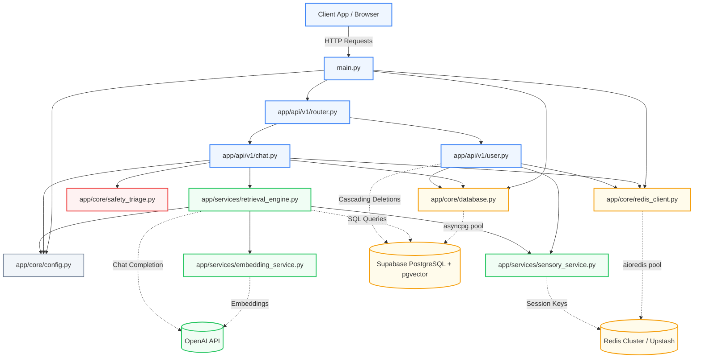

# Codebase Dependency Graph & Structural Analysis

> **Document Classification**: Architectural Dependency Analysis & Call Graph  
> **System**: AI Wellness Longitudinal Memory System (LMS)  
> **Scope**: Complete codebase (Files, Functions, Classes, Schemas, Models, Databases, APIs)

---

## Table of Contents

1. [Step 1 — Inventory](#step-1--inventory)
2. [Step 2 — Edges & Detailed Symbol Relationships](#step-2--edges--detailed-symbol-relationships)
3. [Step 3 — Dependency Diagrams](#step-3--dependency-diagrams)
   - [Diagram 1: High-Level Module Architecture Graph](#diagram-1-high-level-module-architecture-graph)
   - [Diagram 2: Granular Function & Class Level Dependency Graph](#diagram-2-granular-function--class-level-dependency-graph)
4. [Step 4 — Structural Analysis & Architectural Observations](#step-4--structural-analysis--architectural-observations)
   - [1. Hub Nodes](#1-hub-nodes-high-fan-in--fan-out)
   - [2. Circular Dependencies](#2-circular-dependencies)
   - [3. [UNUSED] & [ORPHAN] Nodes](#3-unused--orphan-nodes)
   - [4. Structural Inversions & Decoupling](#4-decoupled--inverted-structural-patterns)

---

## Step 1 — Inventory

Every file and top-level symbol (function, class, instance, schema) defined in the repository is inventoried below.

| File Path | Defined Symbol | Type | Description |
| :--- | :--- | :--- | :--- |
| **`main.py`** | `lifespan(app)` | Function | Async lifecycle context manager (Redis startup/shutdown). |
| | `app` | Instance | Root `FastAPI` application instance. |
| | `health_check()` | Function | Handler for `GET /api/v1/health`. |
| | `root()` | Function | Handler for `GET /`. |
| **`build_pdf.py`** | `generate_pdf()` | Function | Standalone utility compiling audit docs to PDF via headless Edge. |
| **`schema.sql`** | *DDL Schema* | SQL | PostgreSQL DDL for tables, indexes, and pgvector extension. |
| **`requirements.txt`** | *Dependencies* | Config | Pinned and baseline Python package requirements. |
| **`.env.example`** | *Env Template* | Config | Template documenting environment variable keys and defaults. |
| **`README.md`** | *Documentation* | Doc | High-level system overview and quick-start instructions. |
| **`BUILD_PHASES_ROADMAP.md`** | *Roadmap* | Doc | 10-phase technical implementation specification. |
| **`CODEBASE_AUDIT.md`** | *Audit Doc* | Doc | Comprehensive technical audit and system architecture. |
| **`app/__init__.py`** | *(empty)* | Package | Package marker. |
| **`app/core/__init__.py`** | *(empty)* | Package | Package marker. |
| **`app/core/config.py`** | `Settings` | Class | Pydantic `BaseSettings` declaring typed environment configuration. |
| | `get_settings()` | Function | LRU-cached singleton provider for `Settings`. |
| **`app/core/database.py`** | `engine` | Instance | Async SQLAlchemy engine for Supabase PostgreSQL. |
| | `AsyncSessionLocal` | Instance | Async SQLAlchemy sessionmaker. |
| | `Base` | Class | Shared `DeclarativeBase` for all ORM models. |
| | `get_db()` | Function | FastAPI async session dependency (yield/commit/rollback/close). |
| | `ping_database()` | Function | Database health check running `SELECT 1`. |
| **`app/core/redis_client.py`** | `_redis_pool` | Variable | Module-level singleton reference to the `aioredis` pool. |
| | `init_redis()` | Function | Initializes and validates the Redis connection pool. |
| | `close_redis()` | Function | Gracefully closes the Redis connection pool. |
| | `get_redis_client()` | Function | Returns the raw active Redis client instance. |
| | `get_redis()` | Function | FastAPI dependency yielding the shared Redis client. |
| | `ping_redis()` | Function | Sends a `PING` command to verify Redis connectivity. |
| **`app/core/safety_triage.py`** | `CRISIS_RESOURCES` | Constant | List of crisis helplines and emergency contact numbers. |
| | `SELF_HARM_KEYWORDS` | Constant | Regex trigger set for self-harm / suicidal ideation. |
| | `EATING_DISORDER_CRISIS_KEYWORDS` | Constant | Regex trigger set for eating disorder emergencies. |
| | `ACUTE_MEDICAL_KEYWORDS` | Constant | Regex trigger set for acute medical distress. |
| | `_ALL_PATTERNS` | Constant | Pre-compiled list of all regex patterns. |
| | `_PATTERN_TYPE_MAP` | Constant | Dictionary mapping compiled pattern objects to crisis types. |
| | `_TRIAGE_MESSAGES` | Constant | Dictionary of crisis-specific opening messages. |
| | `TriageResponse` | Class | Dataclass storing structured triage response fields. |
| | `TriageResponse.to_client_response()` | Method | Serializes triage data for the client response payload. |
| | `SafetyResult` | Class | Dataclass holding safety boolean and optional `TriageResponse`. |
| | `evaluate_clinical_safety()` | Function | Fast deterministic regex screener evaluating input messages. |
| **`app/models/__init__.py`** | *(empty)* | Package | Package marker. |
| **`app/models/user.py`** | `User` | Class | SQLAlchemy ORM model for the `users` table. |
| **`app/models/episode.py`** | `Episode` | Class | SQLAlchemy ORM model for the `episodes` table. |
| **`app/models/semantic_memory.py`** | `SemanticMemory` | Class | SQLAlchemy ORM model for the `semantic_memories` table. |
| **`app/models/biometrics.py`** | `BiometricsStream` | Class | SQLAlchemy ORM model for the `biometrics_stream` table. |
| **`app/schemas/__init__.py`** | *(empty)* | Package | Package marker. |
| **`app/schemas/chat.py`** | `ChatRequest` | Class | Pydantic model for incoming `POST /api/v1/chat` payloads. |
| | `SessionMessage` | Class | Pydantic model for Redis Layer 1 buffer entries. |
| | `ChatResponse` | Class | Pydantic model for outgoing chat responses. |
| | `CrisisResource` | Class | Pydantic model for a single crisis contact resource. |
| | `CrisisTriageResponse` | Class | Pydantic model for safety override responses. |
| | `HealthResponse` | Class | Pydantic model for `GET /api/v1/health`. |
| **`app/services/__init__.py`** | *(empty)* | Package | Package marker. |
| **`app/services/embedding_service.py`** | `_openai_client` | Variable | Module-level singleton instance of `AsyncOpenAI`. |
| | `get_openai_client()` | Function | Lazy initializer for `AsyncOpenAI`. |
| | `embed_text()` | Function | Converts a text string into a 1536-dim embedding vector. |
| | `embed_batch()` | Function | Batch-embeds a list of text strings in a single API call. |
| **`app/services/sensory_service.py`** | `_session_key()` | Function | Computes Redis key format `sensory:{user_id}:session`. |
| | `get_active_session()` | Function | Fetches last $N$ messages from the Redis session list. |
| | `append_message()` | Function | Appends message, enforces rolling window, and resets TTL. |
| | `flush_session()` | Function | Atomically retrieves and clears the Redis session list. |
| | `session_exists()` | Function | Checks if an active session key exists in Redis. |
| **`app/services/retrieval_engine.py`** | `apply_time_decay()` | Function | Computes $S_{adj} = S_{raw} \cdot e^{-\lambda \Delta t}$. |
| | `apply_time_decay_batch()` | Function | Vectorized NumPy batch decay calculation. |
| | `fetch_episodic_context()` | Function | Queries Layer 2 episodes within the active window. |
| | `fetch_semantic_memories()` | Function | Queries Layer 3 semantic memories via pgvector HNSW. |
| | `filter_by_decay()` | Function | Applies decay scoring and filters candidates by threshold. |
| | `assemble_system_prompt()` | Function | Formats prompt containing Layers 1, 2, and 3 context. |
| | `run_hybrid_rag_pipeline()` | Function | Orchestrates parallel retrieval, decay, LLM call, and Redis updates. |
| **`app/api/__init__.py`** | *(empty)* | Package | Package marker. |
| **`app/api/v1/__init__.py`** | *(empty)* | Package | Package marker. |
| **`app/api/v1/router.py`** | `api_router` | Instance | `APIRouter` mounting `chat.router` and `user.router`. |
| **`app/api/v1/chat.py`** | `router` | Instance | `APIRouter` handling chat routes. |
| | `chat()` | Function | Endpoint handler for `POST /api/v1/chat`. |
| **`app/api/v1/user.py`** | `router` | Instance | `APIRouter` handling user routes. |
| | `delete_user_memory()` | Function | Endpoint handler for `DELETE /api/v1/user/{user_id}/memory`. |
| | `get_user_profile()` | Function | Endpoint handler for `GET /api/v1/user/{user_id}/profile`. |
| **`tests/__init__.py`** | *(empty)* | Package | Package marker. |
| **`tests/test_safety_triage.py`** | `TestSelfHarmDetection` | Class | Unit tests for self-harm pattern detection. |
| | `TestEatingDisorderDetection` | Class | Unit tests for eating disorder pattern detection. |
| | `TestAcuteMedicalDetection` | Class | Unit tests for acute medical emergency detection. |
| | `TestSafeMessages` | Class | Unit tests confirming no false positives on safe messages. |
| **`tests/test_time_decay.py`** | `TestTimeDeratingMath` | Class | Mathematical verification tests for exponential decay. |
| | `TestFilterByDecay` | Class | Unit tests for thresholding and candidate ranking. |
| | `TestBatchDecay` | Class | Unit tests comparing scalar vs vectorized NumPy decay math. |
| **`tests/test_chat_pipeline.py`** | `TestHealthEndpoint` | Class | Integration tests for `/api/v1/health` and `/`. |
| | `TestChatEndpointSafetyOverride` | Class | Integration tests for clinical safety interception. |
| | `TestChatRequestValidation` | Class | Integration tests for Pydantic input validation errors. |

---

## Step 2 — Edges & Detailed Symbol Relationships

```
Legend:
  [Calls / Depends On] -> Target functions, DB tables, schemas, or external APIs
  [Called By]          -> Functions, routes, or tests that invoke this symbol
  [UNUSED]             -> Defined in codebase but never called by any active code/endpoint
  [ORPHAN]             -> Entire file is never imported by the runtime application tree
```

### `main.py`
- **`lifespan`**:
  - *Depends On*: `app.core.config.get_settings`, `app.core.redis_client.init_redis`, `app.core.redis_client.close_redis`
  - *Called By*: `main.app` (FastAPI lifecycle)
- **`app`**:
  - *Depends On*: `lifespan`, `app.api.v1.router.api_router`, `CORSMiddleware`
  - *Called By*: ASGI server (`uvicorn main:app`), `tests/test_chat_pipeline.py`
- **`health_check`**:
  - *Depends On*: `app.core.database.ping_database`, `app.core.redis_client.ping_redis`, `app.schemas.chat.HealthResponse`
  - *Called By*: HTTP `GET /api/v1/health` (FastAPI route registry)
- **`root`**:
  - *Depends On*: `app.core.config.get_settings`
  - *Called By*: HTTP `GET /` (FastAPI route registry)

### `build_pdf.py` `[ORPHAN]`
- **`generate_pdf`**:
  - *Depends On*: `markdown`, `subprocess`, external executable `msedge.exe` / `chrome.exe`
  - *Called By*: Standalone CLI script (`python build_pdf.py`)

### `app/core/config.py`
- **`Settings`**:
  - *Depends On*: `.env` file via `pydantic_settings.BaseSettings`
  - *Called By*: `get_settings()`
- **`get_settings`**:
  - *Depends On*: `Settings`, `functools.lru_cache`
  - *Called By*: `main.py`, `app.core.database`, `app.core.redis_client`, `app.services.embedding_service`, `app.services.sensory_service`, `app.services.retrieval_engine`, `app.api.v1.chat`

### `app/core/database.py`
- **`engine`**:
  - *Depends On*: `get_settings().SUPABASE_DB_URL`, `create_async_engine`, `asyncpg`
  - *Called By*: `AsyncSessionLocal`
- **`AsyncSessionLocal`**:
  - *Depends On*: `engine`, `async_sessionmaker`
  - *Called By*: `get_db()`, `ping_database()`
- **`Base`**:
  - *Depends On*: `sqlalchemy.orm.DeclarativeBase`
  - *Called By*: `app.models.user.User`, `app.models.episode.Episode`, `app.models.semantic_memory.SemanticMemory`, `app.models.biometrics.BiometricsStream`
- **`get_db`**:
  - *Depends On*: `AsyncSessionLocal`, PostgreSQL connection
  - *Called By*: `app.api.v1.chat.chat` (FastAPI `Depends`), `app.api.v1.user.delete_user_memory` (FastAPI `Depends`), `app.api.v1.user.get_user_profile` (FastAPI `Depends`)
- **`ping_database`**:
  - *Depends On*: `AsyncSessionLocal`, SQL `SELECT 1`
  - *Called By*: `main.health_check`

### `app/core/redis_client.py`
- **`init_redis`**:
  - *Depends On*: `get_settings().REDIS_URL`, `aioredis.from_url`
  - *Called By*: `main.lifespan`
- **`close_redis`**:
  - *Depends On*: `_redis_pool.aclose()`
  - *Called By*: `main.lifespan`
- **`get_redis_client`**:
  - *Depends On*: `_redis_pool`
  - *Called By*: `get_redis()`, `ping_redis()`
- **`get_redis`**:
  - *Depends On*: `get_redis_client()`
  - *Called By*: `app.api.v1.chat.chat` (FastAPI `Depends`), `app.api.v1.user.delete_user_memory` (FastAPI `Depends`)
- **`ping_redis`**:
  - *Depends On*: `get_redis_client().ping()`
  - *Called By*: `main.health_check`

### `app/core/safety_triage.py`
- **`evaluate_clinical_safety`**:
  - *Depends On*: `_PATTERN_TYPE_MAP`, `_TRIAGE_MESSAGES`, `CRISIS_RESOURCES`, `TriageResponse`, `SafetyResult`
  - *Called By*: `app.api.v1.chat.chat`, `tests.test_safety_triage.*`
- **`TriageResponse.to_client_response`**:
  - *Depends On*: Internal attributes
  - *Called By*: `app.api.v1.chat.chat`, `tests.test_safety_triage.TestSelfHarmDetection.test_client_response_excludes_internal_fields`

### `app/models/` `[UNUSED (Models defined but bypassed by raw SQL)]`
- **`User`**: Subclasses `Base`. *Depends On*: PostgreSQL `users` table. *Called By*: None (ORM class is never imported; `app.api.v1.user` runs raw SQL `text(...)`). `[UNUSED]`
- **`Episode`**: Subclasses `Base`. *Depends On*: PostgreSQL `episodes` table. *Called By*: None (ORM class is never imported; `retrieval_engine` runs raw SQL `text(...)`). `[UNUSED]`
- **`SemanticMemory`**: Subclasses `Base`. *Depends On*: PostgreSQL `semantic_memories` table, `pgvector`. *Called By*: None (ORM class is never imported; `retrieval_engine` runs raw SQL `text(...)`). `[UNUSED]`
- **`BiometricsStream`**: Subclasses `Base`. *Depends On*: PostgreSQL `biometrics_stream` table. *Called By*: None (Phase 10 placeholder). `[UNUSED]`

### `app/schemas/chat.py`
- **`ChatRequest`**: *Called By*: `app.api.v1.chat.chat`
- **`SessionMessage`**: *Called By*: `app.services.sensory_service.*`, `app.services.retrieval_engine.assemble_system_prompt`
- **`ChatResponse`**: *Called By*: `app.api.v1.chat.chat`
- **`CrisisResource`**: *Called By*: `CrisisTriageResponse`
- **`CrisisTriageResponse`**: *Called By*: `app.api.v1.chat.chat` (OpenAPI response model metadata only; runtime returns dict)
- **`HealthResponse`**: *Called By*: `main.health_check`

### `app/services/embedding_service.py`
- **`get_openai_client`**:
  - *Depends On*: `get_settings().OPENAI_API_KEY`, `openai.AsyncOpenAI`
  - *Called By*: `embed_text()`, `embed_batch()`, `app.services.retrieval_engine.run_hybrid_rag_pipeline`
- **`embed_text`**:
  - *Depends On*: `get_openai_client()`, OpenAI API (`text-embedding-3-small`)
  - *Called By*: `app.services.retrieval_engine.run_hybrid_rag_pipeline`
- **`embed_batch`**:
  - *Depends On*: `get_openai_client()`, OpenAI API (`text-embedding-3-small`)
  - *Called By*: None in Phase 1 (Phase 7 batch consolidation helper). `[UNUSED]`

### `app/services/sensory_service.py`
- **`_session_key`**:
  - *Called By*: `get_active_session()`, `append_message()`, `flush_session()`, `session_exists()`
- **`get_active_session`**:
  - *Depends On*: Redis list `sensory:{user_id}:session`, `_session_key`, `SessionMessage`
  - *Called By*: `app.services.retrieval_engine.run_hybrid_rag_pipeline`, `flush_session()`
- **`append_message`**:
  - *Depends On*: Redis pipeline (`rpush`, `ltrim`, `expire`), `_session_key`, `SessionMessage`
  - *Called By*: `app.services.retrieval_engine.run_hybrid_rag_pipeline`
- **`flush_session`**:
  - *Depends On*: `get_active_session()`, Redis `delete`, `_session_key`
  - *Called By*: `app.api.v1.user.delete_user_memory`
- **`session_exists`**:
  - *Depends On*: Redis `exists`, `_session_key`
  - *Called By*: None in Phase 1 (Phase 3 session state helper). `[UNUSED]`

### `app/services/retrieval_engine.py`
- **`apply_time_decay`**:
  - *Depends On*: `get_settings().DECAY_LAMBDA`, `numpy.exp`
  - *Called By*: `filter_by_decay()`, `tests.test_time_decay.*`
- **`apply_time_decay_batch`**:
  - *Depends On*: `get_settings().DECAY_LAMBDA`, `numpy.exp`
  - *Called By*: `tests.test_time_decay.TestBatchDecay` (Unused in `app/` runtime; Phase 9 helper).
- **`fetch_episodic_context`**:
  - *Depends On*: PostgreSQL table `episodes`, `get_settings().EPISODIC_ACTIVE_DAYS`, `sqlalchemy.text`
  - *Called By*: `run_hybrid_rag_pipeline()`
- **`fetch_semantic_memories`**:
  - *Depends On*: PostgreSQL table `semantic_memories`, `pgvector` HNSW operator `<->`, `sqlalchemy.text`
  - *Called By*: `run_hybrid_rag_pipeline()`
- **`filter_by_decay`**:
  - *Depends On*: `apply_time_decay()`, `get_settings().SIMILARITY_THRESHOLD`
  - *Called By*: `run_hybrid_rag_pipeline()`, `tests.test_time_decay.TestFilterByDecay`
- **`assemble_system_prompt`**:
  - *Depends On*: `get_settings().EPISODIC_ACTIVE_DAYS`
  - *Called By*: `run_hybrid_rag_pipeline()`
- **`run_hybrid_rag_pipeline`**:
  - *Depends On*: `embedding_service.embed_text`, `sensory_service.get_active_session`, `fetch_episodic_context`, `fetch_semantic_memories`, `filter_by_decay`, `assemble_system_prompt`, `embedding_service.get_openai_client`, OpenAI API (`gpt-4o-mini`), `sensory_service.append_message`
  - *Called By*: `app.api.v1.chat.chat`

### `app/api/v1/`
- **`api_router`**: Mounts `chat.router` and `user.router`. *Called By*: `main.py`
- **`chat.chat`**:
  - *Depends On*: `ChatRequest`, `ChatResponse`, `get_db`, `get_redis`, `safety_triage.evaluate_clinical_safety`, `retrieval_engine.run_hybrid_rag_pipeline`
  - *Called By*: HTTP `POST /api/v1/chat`
- **`user.delete_user_memory`**:
  - *Depends On*: `get_db`, `get_redis`, SQL deletes across `semantic_memories`, `episodes`, `biometrics_stream`, `users`, `sensory_service.flush_session`
  - *Called By*: HTTP `DELETE /api/v1/user/{user_id}/memory`
- **`user.get_user_profile`**:
  - *Depends On*: `get_db`, SQL select on `users` table
  - *Called By*: HTTP `GET /api/v1/user/{user_id}/profile`

---

## Step 3 — Dependency Diagrams

### Diagram 1: High-Level Module Architecture Graph



---

### Diagram 2: Granular Function & Class Level Dependency Graph

```mermaid
graph TD
    classDef entry fill:#eff6ff,stroke:#2563eb,stroke-width:1.5px;
    classDef core fill:#f8fafc,stroke:#475569,stroke-width:1.5px;
    classDef service fill:#f0fdf4,stroke:#16a34a,stroke-width:1.5px;
    classDef ext fill:#fff1f2,stroke:#e11d48,stroke-width:1.5px;
    classDef unused fill:#f3f4f6,stroke:#9ca3af,stroke-dasharray: 4 4;

    subgraph MainFile ["main.py"]
        m_lifespan["lifespan"]:::entry
        m_app["app"]:::entry
        m_health["health_check"]:::entry
        m_root["root"]:::entry
    end

    subgraph ConfigFile ["app/core/config.py"]
        c_settings["Settings"]:::core
        c_get_settings["get_settings"]:::core
    end

    subgraph DBFile ["app/core/database.py"]
        db_engine["engine"]:::core
        db_session["AsyncSessionLocal"]:::core
        db_base["Base"]:::core
        db_get_db["get_db"]:::core
        db_ping["ping_database"]:::core
    end

    subgraph RedisFile ["app/core/redis_client.py"]
        r_init["init_redis"]:::core
        r_close["close_redis"]:::core
        r_get_client["get_redis_client"]:::core
        r_get_redis["get_redis"]:::core
        r_ping["ping_redis"]:::core
    end

    subgraph SafetyFile ["app/core/safety_triage.py"]
        s_eval["evaluate_clinical_safety"]:::core
        s_resp["TriageResponse"]:::core
        s_client_resp["TriageResponse.to_client_response"]:::core
    end

    subgraph ChatSchemaFile ["app/schemas/chat.py"]
        sch_req["ChatRequest"]:::core
        sch_msg["SessionMessage"]:::core
        sch_resp["ChatResponse"]:::core
        sch_health["HealthResponse"]:::core
    end

    subgraph EmbedFile ["app/services/embedding_service.py"]
        e_client["get_openai_client"]:::service
        e_text["embed_text"]:::service
        e_batch["embed_batch [UNUSED]"]:::unused
    end

    subgraph SensoryFile ["app/services/sensory_service.py"]
        sn_key["_session_key"]:::service
        sn_get["get_active_session"]:::service
        sn_append["append_message"]:::service
        sn_flush["flush_session"]:::service
        sn_exists["session_exists [UNUSED]"]:::unused
    end

    subgraph RetrievalFile ["app/services/retrieval_engine.py"]
        rt_decay["apply_time_decay"]:::service
        rt_decay_batch["apply_time_decay_batch [UNUSED]"]:::unused
        rt_episodes["fetch_episodic_context"]:::service
        rt_semantic["fetch_semantic_memories"]:::service
        rt_filter["filter_by_decay"]:::service
        rt_prompt["assemble_system_prompt"]:::service
        rt_pipeline["run_hybrid_rag_pipeline"]:::service
    end

    subgraph ChatAPIFile ["app/api/v1/chat.py"]
        api_chat["chat"]:::entry
    end

    subgraph UserAPIFile ["app/api/v1/user.py"]
        api_delete["delete_user_memory"]:::entry
        api_profile["get_user_profile"]:::entry
    end

    subgraph ModelsFile ["app/models/ (Bypassed by raw SQL)"]
        mod_user["User [UNUSED]"]:::unused
        mod_ep["Episode [UNUSED]"]:::unused
        mod_sem["SemanticMemory [UNUSED]"]:::unused
        mod_bio["BiometricsStream [UNUSED]"]:::unused
    end

    subgraph ExternalServices ["External Services & Databases"]
        ext_pg[("PostgreSQL")]:::ext
        ext_redis[("Redis")]:::ext
        ext_openai[("OpenAI API")]:::ext
    end

    %% Internal Call Graph
    m_lifespan --> r_init
    m_lifespan --> r_close
    m_health --> db_ping
    m_health --> r_ping
    m_health --> sch_health
    m_root --> c_get_settings

    c_get_settings --> c_settings

    db_session --> db_engine
    db_get_db --> db_session
    db_ping --> db_session
    db_ping -.-> ext_pg
    db_base -.-> mod_user
    db_base -.-> mod_ep
    db_base -.-> mod_sem
    db_base -.-> mod_bio

    r_init -.-> ext_redis
    r_close -.-> ext_redis
    r_get_redis --> r_get_client
    r_ping --> r_get_client
    r_get_client -.-> ext_redis

    s_eval --> s_resp
    s_resp --> s_client_resp

    e_text --> e_client
    e_batch --> e_client
    e_client -.-> ext_openai

    sn_get --> sn_key
    sn_get --> sch_msg
    sn_append --> sn_key
    sn_append --> sch_msg
    sn_flush --> sn_get
    sn_flush --> sn_key
    sn_exists --> sn_key
    sn_get -.-> ext_redis
    sn_append -.-> ext_redis
    sn_flush -.-> ext_redis

    rt_filter --> rt_decay
    rt_pipeline --> e_text
    rt_pipeline --> sn_get
    rt_pipeline --> rt_episodes
    rt_pipeline --> rt_semantic
    rt_pipeline --> rt_filter
    rt_pipeline --> rt_prompt
    rt_pipeline --> e_client
    rt_pipeline --> sn_append
    rt_episodes -.-> ext_pg
    rt_semantic -.-> ext_pg

    api_chat --> sch_req
    api_chat --> db_get_db
    api_chat --> r_get_redis
    api_chat --> s_eval
    api_chat --> s_client_resp
    api_chat --> rt_pipeline
    api_chat --> sch_resp

    api_delete --> db_get_db
    api_delete --> r_get_redis
    api_delete --> sn_flush
    api_delete -.-> ext_pg

    api_profile --> db_get_db
    api_profile -.-> ext_pg
```



---

## Step 4 — Structural Analysis & Architectural Observations

### 1. Hub Nodes (High Fan-In / Fan-Out)

- **`app/core/config.py::get_settings` (Fan-In: 8)**
  - *Analysis*: Central configuration singleton accessed across `main.py`, database, redis, services, and chat route. It is properly shielded with `@lru_cache(maxsize=1)` to avoid repeated disk parsing.
- **`app/services/retrieval_engine.py::run_hybrid_rag_pipeline` (Fan-Out: 8)**
  - *Analysis*: Acts as the central orchestrator of the Hybrid RAG architecture. It coordinates parallel retrieval across Layer 1 (Redis), Layer 2 (PostgreSQL episodes), Layer 3 (pgvector), applies decay scoring, calls OpenAI, and writes message history back to Redis.
- **`app/core/database.py::get_db` (Fan-In: 3)**
  - *Analysis*: Primary transaction boundary manager for all PostgreSQL operations, ensuring auto-commit on route success and rollback on exceptions.

### 2. Circular Dependencies
- **Status**: **Zero Circular Dependencies Detected**.
- The dependency hierarchy flows strictly downward in layers:
  $$\text{API Routes} \longrightarrow \text{Services} \longrightarrow \text{Core Infrastructure} \longrightarrow \text{External I/O}$$
  No service imports from `api/`, and no core infrastructure module imports from `services/`.

### 3. [UNUSED] & [ORPHAN] Nodes

| Symbol / File | Classification | Rationale & Recommendation |
| :--- | :--- | :--- |
| **`app/models/*` (`User`, `Episode`, `SemanticMemory`, `BiometricsStream`)** | `[UNUSED]` | Models are defined using SQLAlchemy declarative Base, but **never imported or queried via the ORM** because `retrieval_engine.py` and `api/v1/user.py` use raw SQL queries (`sqlalchemy.text`). **Action**: Retain for Phase 2/4 ORM migration, or transition raw SQL to use model tables. |
| **`app/services/embedding_service.py::embed_batch`** | `[UNUSED]` | Helper built for Phase 7 batch consolidation. Currently uncalled in the Phase 1 runtime path. |
| **`app/services/sensory_service.py::session_exists`** | `[UNUSED]` | Helper built for Phase 3 session lifecycle tracking. Currently uncalled. |
| **`app/services/retrieval_engine.py::apply_time_decay_batch`** | `[UNUSED in app/]` | NumPy vectorized decay math called exclusively by `tests/test_time_decay.py`. Will serve Phase 9 benchmarking. |
| **`build_pdf.py`** | `[ORPHAN]` | Standalone documentation utility script. Not part of the runtime server application. |

### 4. Decoupled & Inverted Structural Patterns

- **Decoupled ORM vs Raw SQL**:
  `app/models/` establishes an ORM mapping, yet `fetch_episodic_context`, `fetch_semantic_memories`, `delete_user_memory`, and `get_user_profile` all issue raw parameterized SQL strings (`sqlalchemy.text(...)`). While raw SQL provides fine-grained control over the `pgvector` `<->` distance operator and PostgreSQL interval queries, it bypasses SQLAlchemy's schema validation, leaving `app/models/` decoupled from the execution path.
- **Pre-LLM vs Post-LLM State Modification**:
  In `retrieval_engine.py`, `sensory_service.append_message` writes both the user turn and the assistant turn *after* the OpenAI chat completion finishes. If the external LLM API fails, the user's incoming message is not saved to the Redis sensory buffer, causing a loss of short-term dialogue context for that turn. Moving the user message append prior to LLM dispatch creates a more resilient conversational record.
